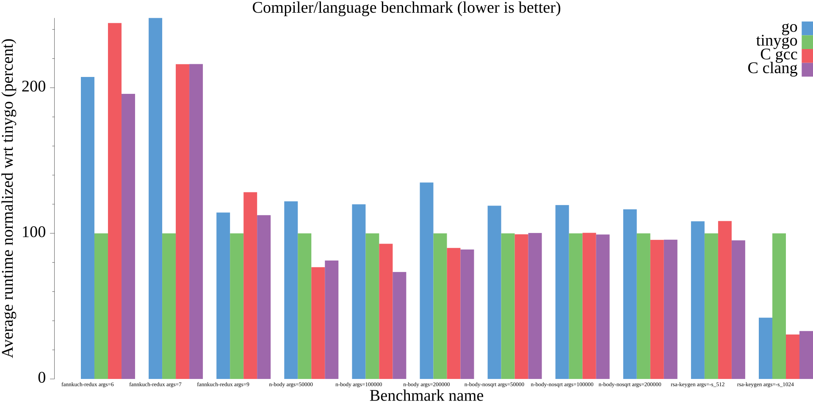

# tinybench

Benchmarks for comparing TinyGo performance.

## Benchmarks chosen and focus

- `fannkuch-redux`: Focused on integer operations on short arrays
- `fasta`: Generate and write random DNA sequences. This benchmark makes some use of dynamic memory allocation, thus putting Go's GC to test as well as Zig's allocator.
- `n-body`: Floating point operations and usage of math library (sqrt)
- `n-body-nosqrt`: Identical to above but replaces call to square-root math library function with a iterative solution. This benchmark shows the difference between C and Go math standard libraries. Go math library has more overhead for assembly implemented functions.
- `spectral-norm`: Eigenvalue using the power method. This benchmark makes extensive use of dynamic memory allocation.



## Compilers

- [clang](https://clang.llvm.org/)
- [gcc](https://gcc.gnu.org/)
- [TinyGo](https://tinygo.org/getting-started/). Either [quick install](https://tinygo.org/getting-started/install/) or [build from source](https://tinygo.org/docs/guides/build/)
- [Go](https://go.dev/)
- [Rust](https://www.rust-lang.org/)
- [Zig](https://ziglang.org/)


## Run Benchmarks

```sh
go test -v -bench=.

# Or to only run a certain test's benchmarks use expression "BenchmarkAll/<NAME OF TEST>:" 
go test -v -bench "BenchmarkAll/n-body:"  # You may need to escape the colon on windows powershell.
```

#### Generate benchmark image

Note the below command will not output results
```sh
go test -v -bench . | go run ./plot_/ -o benchmark.png
```


#### Output for 13th Gen Intel(R) Core(TM) i9-13900HX

<details>
<summary>Click to display</summary>

```
goos: linux
goarch: amd64
pkg: tinybench
cpu: 13th Gen Intel(R) Core(TM) i9-13900HX
BenchmarkAll
    bench_test.go:107: found compiler zig 0.15.2
    bench_test.go:107: found compiler rustc 1.92.0
    bench_test.go:107: found compiler go 1.25.5
    bench_test.go:107: found compiler tinygo 0.40.0
    bench_test.go:107: found compiler gcc 13.3.0
    bench_test.go:107: found compiler clang 20.1.1
    bench_test.go:109: looking for benchmarks in [fannkuch-redux fasta n-body n-body-nosqrt spectral-norm]
BenchmarkAll/fannkuch-redux:args=6/zig/zig
    bench_test.go:145: name="fannkuch-redux" compiler="zig" binarysize=2346896 version=0.15.2
BenchmarkAll/fannkuch-redux:args=6/zig/zig-32         	    1819	    633574 ns/op
BenchmarkAll/fannkuch-redux:args=7/zig/zig
BenchmarkAll/fannkuch-redux:args=7/zig/zig-32         	    1226	    943909 ns/op
BenchmarkAll/fannkuch-redux:args=9/zig/zig
BenchmarkAll/fannkuch-redux:args=9/zig/zig-32         	      62	  17605294 ns/op
BenchmarkAll/fannkuch-redux:args=6/rust/rustc
    bench_test.go:145: name="fannkuch-redux" compiler="rustc" binarysize=3888696 version=1.92.0
BenchmarkAll/fannkuch-redux:args=6/rust/rustc-32      	     880	   1314690 ns/op
BenchmarkAll/fannkuch-redux:args=7/rust/rustc
BenchmarkAll/fannkuch-redux:args=7/rust/rustc-32      	     728	   1620621 ns/op
BenchmarkAll/fannkuch-redux:args=9/rust/rustc
BenchmarkAll/fannkuch-redux:args=9/rust/rustc-32      	      46	  21893230 ns/op
BenchmarkAll/fannkuch-redux:args=6/go/go
    bench_test.go:145: name="fannkuch-redux" compiler="go" binarysize=2289991 version=1.25.5
BenchmarkAll/fannkuch-redux:args=6/go/go-32           	     542	   2068653 ns/op
BenchmarkAll/fannkuch-redux:args=7/go/go
BenchmarkAll/fannkuch-redux:args=7/go/go-32           	     482	   2390357 ns/op
BenchmarkAll/fannkuch-redux:args=9/go/go
BenchmarkAll/fannkuch-redux:args=9/go/go-32           	      52	  23616612 ns/op
BenchmarkAll/fannkuch-redux:args=6/go/tinygo
    bench_test.go:145: name="fannkuch-redux" compiler="tinygo" binarysize=1544592 version=0.40.0
BenchmarkAll/fannkuch-redux:args=6/go/tinygo-32       	    1513	    793179 ns/op
BenchmarkAll/fannkuch-redux:args=7/go/tinygo
BenchmarkAll/fannkuch-redux:args=7/go/tinygo-32       	    1096	   1078705 ns/op
BenchmarkAll/fannkuch-redux:args=9/go/tinygo
BenchmarkAll/fannkuch-redux:args=9/go/tinygo-32       	      52	  19505780 ns/op
BenchmarkAll/fannkuch-redux:args=6/c/gcc
    bench_test.go:145: name="fannkuch-redux" compiler="gcc" binarysize=16368 version=13.3.0
BenchmarkAll/fannkuch-redux:args=6/c/gcc-32           	    1093	   1017939 ns/op
BenchmarkAll/fannkuch-redux:args=7/c/gcc
BenchmarkAll/fannkuch-redux:args=7/c/gcc-32           	     850	   1360082 ns/op
BenchmarkAll/fannkuch-redux:args=9/c/gcc
BenchmarkAll/fannkuch-redux:args=9/c/gcc-32           	      55	  22618233 ns/op
BenchmarkAll/fannkuch-redux:args=6/c/clang
    bench_test.go:145: name="fannkuch-redux" compiler="clang" binarysize=16360 version=20.1.1
BenchmarkAll/fannkuch-redux:args=6/c/clang-32         	    1065	   1040170 ns/op
BenchmarkAll/fannkuch-redux:args=7/c/clang
BenchmarkAll/fannkuch-redux:args=7/c/clang-32         	     945	   1377921 ns/op
BenchmarkAll/fannkuch-redux:args=9/c/clang
BenchmarkAll/fannkuch-redux:args=9/c/clang-32         	      57	  21806333 ns/op
BenchmarkAll/fasta:args=12500000/zig/zig
    bench_test.go:145: name="fasta" compiler="zig" binarysize=2349008 version=0.15.2
BenchmarkAll/fasta:args=12500000/zig/zig-32           	       1	1617719307 ns/op
BenchmarkAll/fasta:args=25000000/zig/zig
BenchmarkAll/fasta:args=25000000/zig/zig-32           	       1	3186264922 ns/op
BenchmarkAll/fasta:args=12500000/rust/rustc
    bench_test.go:145: name="fasta" compiler="rustc" binarysize=3889104 version=1.92.0
BenchmarkAll/fasta:args=12500000/rust/rustc-32        	       1	1594440529 ns/op
BenchmarkAll/fasta:args=25000000/rust/rustc
BenchmarkAll/fasta:args=25000000/rust/rustc-32        	       1	3168475590 ns/op
BenchmarkAll/fasta:args=12500000/go/go
    bench_test.go:145: name="fasta" compiler="go" binarysize=2399137 version=1.25.5
BenchmarkAll/fasta:args=12500000/go/go-32             	       1	1504124374 ns/op
BenchmarkAll/fasta:args=25000000/go/go
BenchmarkAll/fasta:args=25000000/go/go-32             	       1	2982303152 ns/op
BenchmarkAll/fasta:args=12500000/go/tinygo
    bench_test.go:145: name="fasta" compiler="tinygo" binarysize=1675560 version=0.40.0
BenchmarkAll/fasta:args=12500000/go/tinygo-32         	       1	1394160337 ns/op
BenchmarkAll/fasta:args=25000000/go/tinygo
BenchmarkAll/fasta:args=25000000/go/tinygo-32         	       1	2770826724 ns/op
BenchmarkAll/fasta:args=12500000/c/gcc
    bench_test.go:145: name="fasta" compiler="gcc" binarysize=16304 version=13.3.0
BenchmarkAll/fasta:args=12500000/c/gcc-32             	       1	1361580724 ns/op
BenchmarkAll/fasta:args=25000000/c/gcc
BenchmarkAll/fasta:args=25000000/c/gcc-32             	       1	2720601685 ns/op
BenchmarkAll/fasta:args=12500000/c/clang
    bench_test.go:145: name="fasta" compiler="clang" binarysize=16280 version=20.1.1
BenchmarkAll/fasta:args=12500000/c/clang-32           	       1	1291232025 ns/op
BenchmarkAll/fasta:args=25000000/c/clang
BenchmarkAll/fasta:args=25000000/c/clang-32           	       1	2583970999 ns/op
BenchmarkAll/n-body:args=50000/zig/zig
    bench_test.go:145: name="n-body" compiler="zig" binarysize=2390408 version=0.15.2
BenchmarkAll/n-body:args=50000/zig/zig-32             	     237	   4847365 ns/op
BenchmarkAll/n-body:args=100000/zig/zig
BenchmarkAll/n-body:args=100000/zig/zig-32            	     163	   7811627 ns/op
BenchmarkAll/n-body:args=200000/zig/zig
BenchmarkAll/n-body:args=200000/zig/zig-32            	      97	  11981283 ns/op
BenchmarkAll/n-body:args=50000/rust/rustc
    bench_test.go:145: name="n-body" compiler="rustc" binarysize=3915288 version=1.92.0
BenchmarkAll/n-body:args=50000/rust/rustc-32          	     205	   6111009 ns/op
BenchmarkAll/n-body:args=100000/rust/rustc
BenchmarkAll/n-body:args=100000/rust/rustc-32         	     126	   9774151 ns/op
BenchmarkAll/n-body:args=200000/rust/rustc
BenchmarkAll/n-body:args=200000/rust/rustc-32         	      87	  16127199 ns/op
BenchmarkAll/n-body:args=50000/go/go
    bench_test.go:145: name="n-body" compiler="go" binarysize=2289681 version=1.25.5
BenchmarkAll/n-body:args=50000/go/go-32               	     141	   8709717 ns/op
BenchmarkAll/n-body:args=100000/go/go
BenchmarkAll/n-body:args=100000/go/go-32              	      86	  13904413 ns/op
BenchmarkAll/n-body:args=200000/go/go
BenchmarkAll/n-body:args=200000/go/go-32              	      44	  23634493 ns/op
BenchmarkAll/n-body:args=50000/go/tinygo
    bench_test.go:145: name="n-body" compiler="tinygo" binarysize=1550496 version=0.40.0
BenchmarkAll/n-body:args=50000/go/tinygo-32           	     202	   5709919 ns/op
BenchmarkAll/n-body:args=100000/go/tinygo
BenchmarkAll/n-body:args=100000/go/tinygo-32          	     130	   9230407 ns/op
BenchmarkAll/n-body:args=200000/go/tinygo
BenchmarkAll/n-body:args=200000/go/tinygo-32          	      63	  16238671 ns/op
BenchmarkAll/n-body:args=50000/c/gcc
    bench_test.go:145: name="n-body" compiler="gcc" binarysize=16440 version=13.3.0
BenchmarkAll/n-body:args=50000/c/gcc-32               	     267	   4944799 ns/op
BenchmarkAll/n-body:args=100000/c/gcc
BenchmarkAll/n-body:args=100000/c/gcc-32              	     152	   7831867 ns/op
BenchmarkAll/n-body:args=200000/c/gcc
BenchmarkAll/n-body:args=200000/c/gcc-32              	     100	  14110339 ns/op
BenchmarkAll/n-body:args=50000/c/clang
    bench_test.go:145: name="n-body" compiler="clang" binarysize=16456 version=20.1.1
BenchmarkAll/n-body:args=50000/c/clang-32             	     246	   5034170 ns/op
BenchmarkAll/n-body:args=100000/c/clang
BenchmarkAll/n-body:args=100000/c/clang-32            	     151	   8207021 ns/op
BenchmarkAll/n-body:args=200000/c/clang
BenchmarkAll/n-body:args=200000/c/clang-32            	     100	  14123126 ns/op
BenchmarkAll/n-body-nosqrt:args=50000/zig/zig
    bench_test.go:145: name="n-body-nosqrt" compiler="zig" binarysize=2395592 version=0.15.2
BenchmarkAll/n-body-nosqrt:args=50000/zig/zig-32      	      62	  17324663 ns/op
BenchmarkAll/n-body-nosqrt:args=100000/zig/zig
BenchmarkAll/n-body-nosqrt:args=100000/zig/zig-32     	      40	  27622738 ns/op
BenchmarkAll/n-body-nosqrt:args=200000/zig/zig
BenchmarkAll/n-body-nosqrt:args=200000/zig/zig-32     	      22	  50589389 ns/op
BenchmarkAll/n-body-nosqrt:args=50000/rust/rustc
    bench_test.go:145: name="n-body-nosqrt" compiler="rustc" binarysize=3915576 version=1.92.0
BenchmarkAll/n-body-nosqrt:args=50000/rust/rustc-32   	      51	  20447674 ns/op
BenchmarkAll/n-body-nosqrt:args=100000/rust/rustc
BenchmarkAll/n-body-nosqrt:args=100000/rust/rustc-32  	      34	  31766297 ns/op
BenchmarkAll/n-body-nosqrt:args=200000/rust/rustc
BenchmarkAll/n-body-nosqrt:args=200000/rust/rustc-32  	      19	  58215653 ns/op
BenchmarkAll/n-body-nosqrt:args=50000/go/go
    bench_test.go:145: name="n-body-nosqrt" compiler="go" binarysize=2289989 version=1.25.5
BenchmarkAll/n-body-nosqrt:args=50000/go/go-32        	      45	  23149709 ns/op
BenchmarkAll/n-body-nosqrt:args=100000/go/go
BenchmarkAll/n-body-nosqrt:args=100000/go/go-32       	      34	  35107568 ns/op
BenchmarkAll/n-body-nosqrt:args=200000/go/go
BenchmarkAll/n-body-nosqrt:args=200000/go/go-32       	      19	  63521325 ns/op
BenchmarkAll/n-body-nosqrt:args=50000/go/tinygo
    bench_test.go:145: name="n-body-nosqrt" compiler="tinygo" binarysize=1551520 version=0.40.0
BenchmarkAll/n-body-nosqrt:args=50000/go/tinygo-32    	      54	  19736992 ns/op
BenchmarkAll/n-body-nosqrt:args=100000/go/tinygo
BenchmarkAll/n-body-nosqrt:args=100000/go/tinygo-32   	      33	  31188916 ns/op
BenchmarkAll/n-body-nosqrt:args=200000/go/tinygo
BenchmarkAll/n-body-nosqrt:args=200000/go/tinygo-32   	      20	  56116773 ns/op
BenchmarkAll/n-body-nosqrt:args=50000/c/gcc
    bench_test.go:145: name="n-body-nosqrt" compiler="gcc" binarysize=16520 version=13.3.0
BenchmarkAll/n-body-nosqrt:args=50000/c/gcc-32        	      63	  18169606 ns/op
BenchmarkAll/n-body-nosqrt:args=100000/c/gcc
BenchmarkAll/n-body-nosqrt:args=100000/c/gcc-32       	      36	  28335468 ns/op
BenchmarkAll/n-body-nosqrt:args=200000/c/gcc
BenchmarkAll/n-body-nosqrt:args=200000/c/gcc-32       	      21	  53150026 ns/op
BenchmarkAll/n-body-nosqrt:args=50000/c/clang
    bench_test.go:145: name="n-body-nosqrt" compiler="clang" binarysize=16552 version=20.1.1
BenchmarkAll/n-body-nosqrt:args=50000/c/clang-32      	      85	  18488146 ns/op
BenchmarkAll/n-body-nosqrt:args=100000/c/clang
BenchmarkAll/n-body-nosqrt:args=100000/c/clang-32     	      43	  29431368 ns/op
BenchmarkAll/n-body-nosqrt:args=200000/c/clang
BenchmarkAll/n-body-nosqrt:args=200000/c/clang-32     	      22	  54315599 ns/op
BenchmarkAll/spectral-norm:args=1000/zig/zig
    bench_test.go:145: name="spectral-norm" compiler="zig" binarysize=2396472 version=0.15.2
BenchmarkAll/spectral-norm:args=1000/zig/zig-32       	      20	  52063787 ns/op
BenchmarkAll/spectral-norm:args=2500/zig/zig
BenchmarkAll/spectral-norm:args=2500/zig/zig-32       	       4	 311235497 ns/op
BenchmarkAll/spectral-norm:args=5500/zig/zig
BenchmarkAll/spectral-norm:args=5500/zig/zig-32       	       1	1492319271 ns/op
BenchmarkAll/spectral-norm:args=1000/rust/rustc
    bench_test.go:145: name="spectral-norm" compiler="rustc" binarysize=3910832 version=1.92.0
BenchmarkAll/spectral-norm:args=1000/rust/rustc-32    	      24	  47602517 ns/op
BenchmarkAll/spectral-norm:args=2500/rust/rustc
BenchmarkAll/spectral-norm:args=2500/rust/rustc-32    	       4	 271072631 ns/op
BenchmarkAll/spectral-norm:args=5500/rust/rustc
BenchmarkAll/spectral-norm:args=5500/rust/rustc-32    	       1	1283657633 ns/op
BenchmarkAll/spectral-norm:args=1000/go/go
    bench_test.go:145: name="spectral-norm" compiler="go" binarysize=2388325 version=1.25.5
BenchmarkAll/spectral-norm:args=1000/go/go-32         	      25	  46605145 ns/op
BenchmarkAll/spectral-norm:args=2500/go/go
BenchmarkAll/spectral-norm:args=2500/go/go-32         	       4	 271363640 ns/op
BenchmarkAll/spectral-norm:args=5500/go/go
BenchmarkAll/spectral-norm:args=5500/go/go-32         	       1	1298903985 ns/op
BenchmarkAll/spectral-norm:args=1000/go/tinygo
    bench_test.go:145: name="spectral-norm" compiler="tinygo" binarysize=1657552 version=0.40.0
BenchmarkAll/spectral-norm:args=1000/go/tinygo-32     	      26	  46597931 ns/op
BenchmarkAll/spectral-norm:args=2500/go/tinygo
BenchmarkAll/spectral-norm:args=2500/go/tinygo-32     	       4	 267115876 ns/op
BenchmarkAll/spectral-norm:args=5500/go/tinygo
BenchmarkAll/spectral-norm:args=5500/go/tinygo-32     	       1	1283194956 ns/op
BenchmarkAll/spectral-norm:args=1000/c/gcc
    bench_test.go:145: name="spectral-norm" compiler="gcc" binarysize=16200 version=13.3.0
BenchmarkAll/spectral-norm:args=1000/c/gcc-32         	      25	  45995812 ns/op
BenchmarkAll/spectral-norm:args=2500/c/gcc
BenchmarkAll/spectral-norm:args=2500/c/gcc-32         	       4	 267731414 ns/op
BenchmarkAll/spectral-norm:args=5500/c/gcc
BenchmarkAll/spectral-norm:args=5500/c/gcc-32         	       1	1281269908 ns/op
BenchmarkAll/spectral-norm:args=1000/c/clang
    bench_test.go:145: name="spectral-norm" compiler="clang" binarysize=16216 version=20.1.1
BenchmarkAll/spectral-norm:args=1000/c/clang-32       	      25	  48064027 ns/op
BenchmarkAll/spectral-norm:args=2500/c/clang
BenchmarkAll/spectral-norm:args=2500/c/clang-32       	       4	 267039126 ns/op
BenchmarkAll/spectral-norm:args=5500/c/clang
BenchmarkAll/spectral-norm:args=5500/c/clang-32       	       1	1295094384 ns/op
PASS
ok  	tinybench	180.529s
```

</details>

## Result Summary

- TinyGo is notably faster at integer number crunching.
- TinyGo and C go head-to-head on floating point math when not calling specialized functions such as `sqrt`. Go lags behind.

## Add a benchmark

The way tinybench works is all directories with no `.` or `_` character (anywhere in name) in this repos' root directory are added to the benchmark corpus.
Within each of these directories a `c` and `go` folder is searched for and their code compiled and run automatically. Flags used for the compilers can be found in [`compilerflags_test.go`](./compilerflags_test.go).

To add a new test follow these steps:

1. Creating a new top level folder with a descriptive name such as `mandelbrot` with no `.` or `_` characters

2. Add an `args.txt` file to the folder with the OS arguments to the program and add a single line with an argument i.e: `-s 1024` (flag `s` with value `1024`).
    - Each line of this file will contain a benchmark case.

3. Create folders with the language you wish to test. Each will be run with arguments provided by `args.txt`. Each folder should contain a single file called `main.<extension>` where `<extension>` is the file extension of the language being teste.
    - `<benchmark-name>/c/main.c`: Contains the C source code for benchmark. Since linking is done via flags you must add your project's flags to `gccFlags` map.
    - `<benchmark-name>/go/main.go`: Will contain a `package main` project that is compiled for the benchmark.
    - `<benchmark-name>/rust/main.rs`: Contains the Rust source code for benchmark.
    - `<benchmark-name>/zig/main.zig`: Contains the Zig source code for benchmark.
