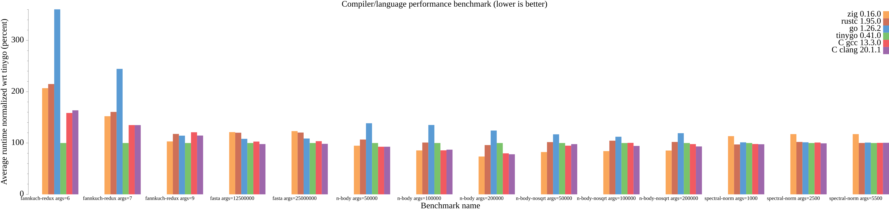

# tinybench

Benchmarks for comparing TinyGo performance.

## Benchmarks chosen and focus

- `fannkuch-redux`: Focused on integer operations on short arrays
- `fasta`: Generate and write random DNA sequences. This benchmark makes some use of dynamic memory allocation, thus putting Go's GC to test as well as Zig's allocator.
- `n-body`: Floating point operations and usage of math library (sqrt)
- `n-body-nosqrt`: Identical to above but replaces call to square-root math library function with an iterative solution. This benchmark shows the difference between C and Go math standard libraries. Go math library has more overhead for assembly implemented functions.
- `spectral-norm`: Eigenvalue using the power method. This benchmark makes extensive use of dynamic memory allocation.



## Benchmark code design
Benchmarks are designed "fairly" and with a focus on runtime performance. In the context of tinybench this means maintaining code equivalence between languages:

- Maintaining equivalence in data structures
- Maintaining equivalence in function signatures, their statements and ordering

We avoid:

- Explicitly moving code to compile-time when we can't do the same in other languages i.e Zig's comptime and C macros

We allow:

- Data structure massaging. C and Zig allow bitpacking which is a commonly used feature in the languages and affects runtime performance, thus should be interesting to allow use.

## Compilers

- [clang](https://clang.llvm.org/)
- [gcc](https://gcc.gnu.org/)
- [TinyGo](https://tinygo.org/getting-started/). Either [quick install](https://tinygo.org/getting-started/install/) or [build from source](https://tinygo.org/docs/guides/build/)
- [Go](https://go.dev/)
- [Rust](https://www.rust-lang.org/)
- [Zig](https://ziglang.org/)


## Run Benchmarks

```sh
go test -v -bench=.

# Or to only run a certain test's benchmarks use expression "BenchmarkAll/<NAME OF TEST>:" 
go test -v -bench "BenchmarkAll/n-body:"  # You may need to escape the colon on windows powershell.
```

#### Generate benchmark image

Note the below command will not output results
```sh
go test -v -bench . | go run ./plot_/ -o benchmark.png
```


#### Output for 13th Gen Intel(R) Core(TM) i9-13900HX

<details>
<summary>Click to display</summary>

```
goos: linux
goarch: amd64
pkg: tinybench
cpu: 13th Gen Intel(R) Core(TM) i9-13900HX
BenchmarkAll
    bench_test.go:107: found compiler zig 0.16.0
    bench_test.go:107: found compiler rustc 1.95.0
    bench_test.go:107: found compiler go 1.26.2
    bench_test.go:107: found compiler tinygo 0.41.0
    bench_test.go:107: found compiler gcc 13.3.0
    bench_test.go:107: found compiler clang 20.1.1
    bench_test.go:109: looking for benchmarks in [fannkuch-redux fasta n-body n-body-nosqrt spectral-norm]
BenchmarkAll/fannkuch-redux:args=6/zig/zig
    bench_test.go:145: name="fannkuch-redux" compiler="zig" binarysize=3744232 version=0.16.0
BenchmarkAll/fannkuch-redux:args=6/zig/zig-32         	    1646	    747861 ns/op
BenchmarkAll/fannkuch-redux:args=7/zig/zig
BenchmarkAll/fannkuch-redux:args=7/zig/zig-32         	    1248	    934797 ns/op
BenchmarkAll/fannkuch-redux:args=9/zig/zig
BenchmarkAll/fannkuch-redux:args=9/zig/zig-32         	      78	  16047658 ns/op
BenchmarkAll/fannkuch-redux:args=6/rust/rustc
    bench_test.go:145: name="fannkuch-redux" compiler="rustc" binarysize=4347464 version=1.95.0
BenchmarkAll/fannkuch-redux:args=6/rust/rustc-32      	    1531	    767822 ns/op
BenchmarkAll/fannkuch-redux:args=7/rust/rustc
BenchmarkAll/fannkuch-redux:args=7/rust/rustc-32      	    1242	    982495 ns/op
BenchmarkAll/fannkuch-redux:args=9/rust/rustc
BenchmarkAll/fannkuch-redux:args=9/rust/rustc-32      	      68	  18562820 ns/op
BenchmarkAll/fannkuch-redux:args=6/go/go
    bench_test.go:145: name="fannkuch-redux" compiler="go" binarysize=2421417 version=1.26.2
BenchmarkAll/fannkuch-redux:args=6/go/go-32           	     894	   1306000 ns/op
BenchmarkAll/fannkuch-redux:args=7/go/go
BenchmarkAll/fannkuch-redux:args=7/go/go-32           	     798	   1490321 ns/op
BenchmarkAll/fannkuch-redux:args=9/go/go
BenchmarkAll/fannkuch-redux:args=9/go/go-32           	      68	  18829719 ns/op
BenchmarkAll/fannkuch-redux:args=6/go/tinygo
    bench_test.go:145: name="fannkuch-redux" compiler="tinygo" binarysize=1559544 version=0.41.0
BenchmarkAll/fannkuch-redux:args=6/go/tinygo-32       	    3122	    349984 ns/op
BenchmarkAll/fannkuch-redux:args=7/go/tinygo
BenchmarkAll/fannkuch-redux:args=7/go/tinygo-32       	    1887	    601597 ns/op
BenchmarkAll/fannkuch-redux:args=9/go/tinygo
BenchmarkAll/fannkuch-redux:args=9/go/tinygo-32       	      74	  15958508 ns/op
BenchmarkAll/fannkuch-redux:args=6/c/gcc
    bench_test.go:145: name="fannkuch-redux" compiler="gcc" binarysize=16368 version=13.3.0
BenchmarkAll/fannkuch-redux:args=6/c/gcc-32           	    1840	    609650 ns/op
BenchmarkAll/fannkuch-redux:args=7/c/gcc
BenchmarkAll/fannkuch-redux:args=7/c/gcc-32           	    1479	    837208 ns/op
BenchmarkAll/fannkuch-redux:args=9/c/gcc
BenchmarkAll/fannkuch-redux:args=9/c/gcc-32           	      68	  19389656 ns/op
BenchmarkAll/fannkuch-redux:args=6/c/clang
    bench_test.go:145: name="fannkuch-redux" compiler="clang" binarysize=16368 version=20.1.1
BenchmarkAll/fannkuch-redux:args=6/c/clang-32         	    1951	    592932 ns/op
BenchmarkAll/fannkuch-redux:args=7/c/clang
BenchmarkAll/fannkuch-redux:args=7/c/clang-32         	    1491	    828121 ns/op
BenchmarkAll/fannkuch-redux:args=9/c/clang
BenchmarkAll/fannkuch-redux:args=9/c/clang-32         	      67	  18646771 ns/op
BenchmarkAll/fasta:args=12500000/zig/zig
    bench_test.go:145: name="fasta" compiler="zig" binarysize=3745872 version=0.16.0
BenchmarkAll/fasta:args=12500000/zig/zig-32           	       1	1594556359 ns/op
BenchmarkAll/fasta:args=25000000/zig/zig
BenchmarkAll/fasta:args=25000000/zig/zig-32           	       1	3200288846 ns/op
BenchmarkAll/fasta:args=12500000/rust/rustc
    bench_test.go:145: name="fasta" compiler="rustc" binarysize=4348280 version=1.95.0
BenchmarkAll/fasta:args=12500000/rust/rustc-32        	       1	1590641545 ns/op
BenchmarkAll/fasta:args=25000000/rust/rustc
BenchmarkAll/fasta:args=25000000/rust/rustc-32        	       1	3161935359 ns/op
BenchmarkAll/fasta:args=12500000/go/go
    bench_test.go:145: name="fasta" compiler="go" binarysize=2531101 version=1.26.2
BenchmarkAll/fasta:args=12500000/go/go-32             	       1	1422508110 ns/op
BenchmarkAll/fasta:args=25000000/go/go
BenchmarkAll/fasta:args=25000000/go/go-32             	       1	2854365339 ns/op
BenchmarkAll/fasta:args=12500000/go/tinygo
    bench_test.go:145: name="fasta" compiler="tinygo" binarysize=1702400 version=0.41.0
BenchmarkAll/fasta:args=12500000/go/tinygo-32         	       1	1312726329 ns/op
BenchmarkAll/fasta:args=25000000/go/tinygo
BenchmarkAll/fasta:args=25000000/go/tinygo-32         	       1	2631708580 ns/op
BenchmarkAll/fasta:args=12500000/c/gcc
    bench_test.go:145: name="fasta" compiler="gcc" binarysize=16312 version=13.3.0
BenchmarkAll/fasta:args=12500000/c/gcc-32             	       1	1355614829 ns/op
BenchmarkAll/fasta:args=25000000/c/gcc
BenchmarkAll/fasta:args=25000000/c/gcc-32             	       1	2705267187 ns/op
BenchmarkAll/fasta:args=12500000/c/clang
    bench_test.go:145: name="fasta" compiler="clang" binarysize=16280 version=20.1.1
BenchmarkAll/fasta:args=12500000/c/clang-32           	       1	1299215537 ns/op
BenchmarkAll/fasta:args=25000000/c/clang
BenchmarkAll/fasta:args=25000000/c/clang-32           	       1	2599609548 ns/op
BenchmarkAll/n-body:args=50000/zig/zig
    bench_test.go:145: name="n-body" compiler="zig" binarysize=3785368 version=0.16.0
BenchmarkAll/n-body:args=50000/zig/zig-32             	     301	   4061665 ns/op
BenchmarkAll/n-body:args=100000/zig/zig
BenchmarkAll/n-body:args=100000/zig/zig-32            	     183	   6484611 ns/op
BenchmarkAll/n-body:args=200000/zig/zig
BenchmarkAll/n-body:args=200000/zig/zig-32            	     100	  10527359 ns/op
BenchmarkAll/n-body:args=50000/rust/rustc
    bench_test.go:145: name="n-body" compiler="rustc" binarysize=4373560 version=1.95.0
BenchmarkAll/n-body:args=50000/rust/rustc-32          	     260	   4675149 ns/op
BenchmarkAll/n-body:args=100000/rust/rustc
BenchmarkAll/n-body:args=100000/rust/rustc-32         	     160	   7793988 ns/op
BenchmarkAll/n-body:args=200000/rust/rustc
BenchmarkAll/n-body:args=200000/rust/rustc-32         	      98	  12931487 ns/op
BenchmarkAll/n-body:args=50000/go/go
    bench_test.go:145: name="n-body" compiler="go" binarysize=2421227 version=1.26.2
BenchmarkAll/n-body:args=50000/go/go-32               	     198	   5991823 ns/op
BenchmarkAll/n-body:args=100000/go/go
BenchmarkAll/n-body:args=100000/go/go-32              	     120	   9899504 ns/op
BenchmarkAll/n-body:args=200000/go/go
BenchmarkAll/n-body:args=200000/go/go-32              	      70	  17259690 ns/op
BenchmarkAll/n-body:args=50000/go/tinygo
    bench_test.go:145: name="n-body" compiler="tinygo" binarysize=1565344 version=0.41.0
BenchmarkAll/n-body:args=50000/go/tinygo-32           	     273	   4317350 ns/op
BenchmarkAll/n-body:args=100000/go/tinygo
BenchmarkAll/n-body:args=100000/go/tinygo-32          	     159	   7552491 ns/op
BenchmarkAll/n-body:args=200000/go/tinygo
BenchmarkAll/n-body:args=200000/go/tinygo-32          	     100	  13110046 ns/op
BenchmarkAll/n-body:args=50000/c/gcc
    bench_test.go:145: name="n-body" compiler="gcc" binarysize=16440 version=13.3.0
BenchmarkAll/n-body:args=50000/c/gcc-32               	     308	   3998546 ns/op
BenchmarkAll/n-body:args=100000/c/gcc
BenchmarkAll/n-body:args=100000/c/gcc-32              	     186	   6482895 ns/op
BenchmarkAll/n-body:args=200000/c/gcc
BenchmarkAll/n-body:args=200000/c/gcc-32              	     100	  11467983 ns/op
BenchmarkAll/n-body:args=50000/c/clang
    bench_test.go:145: name="n-body" compiler="clang" binarysize=16464 version=20.1.1
BenchmarkAll/n-body:args=50000/c/clang-32             	     300	   3994172 ns/op
BenchmarkAll/n-body:args=100000/c/clang
BenchmarkAll/n-body:args=100000/c/clang-32            	     171	   6641416 ns/op
BenchmarkAll/n-body:args=200000/c/clang
BenchmarkAll/n-body:args=200000/c/clang-32            	     100	  11397794 ns/op
BenchmarkAll/n-body-nosqrt:args=50000/zig/zig
    bench_test.go:145: name="n-body-nosqrt" compiler="zig" binarysize=3790448 version=0.16.0
BenchmarkAll/n-body-nosqrt:args=50000/zig/zig-32      	      88	  14129932 ns/op
BenchmarkAll/n-body-nosqrt:args=100000/zig/zig
BenchmarkAll/n-body-nosqrt:args=100000/zig/zig-32     	      40	  25141519 ns/op
BenchmarkAll/n-body-nosqrt:args=200000/zig/zig
BenchmarkAll/n-body-nosqrt:args=200000/zig/zig-32     	      22	  46078388 ns/op
BenchmarkAll/n-body-nosqrt:args=50000/rust/rustc
    bench_test.go:145: name="n-body-nosqrt" compiler="rustc" binarysize=4373896 version=1.95.0
BenchmarkAll/n-body-nosqrt:args=50000/rust/rustc-32   	      76	  17644382 ns/op
BenchmarkAll/n-body-nosqrt:args=100000/rust/rustc
BenchmarkAll/n-body-nosqrt:args=100000/rust/rustc-32  	      38	  30907432 ns/op
BenchmarkAll/n-body-nosqrt:args=200000/rust/rustc
BenchmarkAll/n-body-nosqrt:args=200000/rust/rustc-32  	      18	  58723346 ns/op
BenchmarkAll/n-body-nosqrt:args=50000/go/go
    bench_test.go:145: name="n-body-nosqrt" compiler="go" binarysize=2421583 version=1.26.2
BenchmarkAll/n-body-nosqrt:args=50000/go/go-32        	      64	  19673316 ns/op
BenchmarkAll/n-body-nosqrt:args=100000/go/go
BenchmarkAll/n-body-nosqrt:args=100000/go/go-32       	      34	  33419706 ns/op
BenchmarkAll/n-body-nosqrt:args=200000/go/go
BenchmarkAll/n-body-nosqrt:args=200000/go/go-32       	      18	  67938506 ns/op
BenchmarkAll/n-body-nosqrt:args=50000/go/tinygo
    bench_test.go:145: name="n-body-nosqrt" compiler="tinygo" binarysize=1566368 version=0.41.0
BenchmarkAll/n-body-nosqrt:args=50000/go/tinygo-32    	      80	  16093253 ns/op
BenchmarkAll/n-body-nosqrt:args=100000/go/tinygo
BenchmarkAll/n-body-nosqrt:args=100000/go/tinygo-32   	      43	  29254375 ns/op
BenchmarkAll/n-body-nosqrt:args=200000/go/tinygo
BenchmarkAll/n-body-nosqrt:args=200000/go/tinygo-32   	      21	  55574889 ns/op
BenchmarkAll/n-body-nosqrt:args=50000/c/gcc
    bench_test.go:145: name="n-body-nosqrt" compiler="gcc" binarysize=16520 version=13.3.0
BenchmarkAll/n-body-nosqrt:args=50000/c/gcc-32        	      82	  15926878 ns/op
BenchmarkAll/n-body-nosqrt:args=100000/c/gcc
BenchmarkAll/n-body-nosqrt:args=100000/c/gcc-32       	      44	  27776694 ns/op
BenchmarkAll/n-body-nosqrt:args=200000/c/gcc
BenchmarkAll/n-body-nosqrt:args=200000/c/gcc-32       	      21	  55286022 ns/op
BenchmarkAll/n-body-nosqrt:args=50000/c/clang
    bench_test.go:145: name="n-body-nosqrt" compiler="clang" binarysize=16560 version=20.1.1
BenchmarkAll/n-body-nosqrt:args=50000/c/clang-32      	      68	  16405140 ns/op
BenchmarkAll/n-body-nosqrt:args=100000/c/clang
BenchmarkAll/n-body-nosqrt:args=100000/c/clang-32     	      40	  29718618 ns/op
BenchmarkAll/n-body-nosqrt:args=200000/c/clang
BenchmarkAll/n-body-nosqrt:args=200000/c/clang-32     	      20	  53456238 ns/op
BenchmarkAll/spectral-norm:args=1000/zig/zig
    bench_test.go:145: name="spectral-norm" compiler="zig" binarysize=3793864 version=0.16.0
BenchmarkAll/spectral-norm:args=1000/zig/zig-32       	      20	  54193690 ns/op
BenchmarkAll/spectral-norm:args=2500/zig/zig
BenchmarkAll/spectral-norm:args=2500/zig/zig-32       	       4	 309790432 ns/op
BenchmarkAll/spectral-norm:args=5500/zig/zig
BenchmarkAll/spectral-norm:args=5500/zig/zig-32       	       1	1497676731 ns/op
BenchmarkAll/spectral-norm:args=1000/rust/rustc
    bench_test.go:145: name="spectral-norm" compiler="rustc" binarysize=4369368 version=1.95.0
BenchmarkAll/spectral-norm:args=1000/rust/rustc-32    	      25	  46692793 ns/op
BenchmarkAll/spectral-norm:args=2500/rust/rustc
BenchmarkAll/spectral-norm:args=2500/rust/rustc-32    	       4	 267404843 ns/op
BenchmarkAll/spectral-norm:args=5500/rust/rustc
BenchmarkAll/spectral-norm:args=5500/rust/rustc-32    	       1	1286411296 ns/op
BenchmarkAll/spectral-norm:args=1000/go/go
    bench_test.go:145: name="spectral-norm" compiler="go" binarysize=2520385 version=1.26.2
BenchmarkAll/spectral-norm:args=1000/go/go-32         	      24	  47227103 ns/op
BenchmarkAll/spectral-norm:args=2500/go/go
BenchmarkAll/spectral-norm:args=2500/go/go-32         	       4	 266906560 ns/op
BenchmarkAll/spectral-norm:args=5500/go/go
BenchmarkAll/spectral-norm:args=5500/go/go-32         	       1	1283659695 ns/op
BenchmarkAll/spectral-norm:args=1000/go/tinygo
    bench_test.go:145: name="spectral-norm" compiler="tinygo" binarysize=1679376 version=0.41.0
BenchmarkAll/spectral-norm:args=1000/go/tinygo-32     	      25	  45495707 ns/op
BenchmarkAll/spectral-norm:args=2500/go/tinygo
BenchmarkAll/spectral-norm:args=2500/go/tinygo-32     	       4	 270285473 ns/op
BenchmarkAll/spectral-norm:args=5500/go/tinygo
BenchmarkAll/spectral-norm:args=5500/go/tinygo-32     	       1	1283651432 ns/op
BenchmarkAll/spectral-norm:args=1000/c/gcc
    bench_test.go:145: name="spectral-norm" compiler="gcc" binarysize=16200 version=13.3.0
BenchmarkAll/spectral-norm:args=1000/c/gcc-32         	      24	  45351623 ns/op
BenchmarkAll/spectral-norm:args=2500/c/gcc
BenchmarkAll/spectral-norm:args=2500/c/gcc-32         	       4	 274631113 ns/op
BenchmarkAll/spectral-norm:args=5500/c/gcc
BenchmarkAll/spectral-norm:args=5500/c/gcc-32         	       1	1288776100 ns/op
BenchmarkAll/spectral-norm:args=1000/c/clang
    bench_test.go:145: name="spectral-norm" compiler="clang" binarysize=16224 version=20.1.1
BenchmarkAll/spectral-norm:args=1000/c/clang-32       	      25	  45566618 ns/op
BenchmarkAll/spectral-norm:args=2500/c/clang
BenchmarkAll/spectral-norm:args=2500/c/clang-32       	       4	 267174876 ns/op
BenchmarkAll/spectral-norm:args=5500/c/clang
BenchmarkAll/spectral-norm:args=5500/c/clang-32       	       1	1282946966 ns/op
PASS
ok  	tinybench	196.857s
```

</details>

## Result Summary

- TinyGo is notably faster at integer number crunching.
- TinyGo and C go head-to-head on floating point math when not calling specialized functions such as `sqrt`. Go lags behind.

## Add a benchmark

The way tinybench works is all directories with no `.` or `_` character (anywhere in name) in this repo's root directory are added to the benchmark corpus.
Within each of these directories a `c` and `go` folder is searched for and their code compiled and run automatically. Flags used for the compilers can be found in [`compilerflags_test.go`](./compilerflags_test.go).

To add a new test follow these steps:

1. Creating a new top level folder with a descriptive name such as `mandelbrot` with no `.` or `_` characters

2. Add an `args.txt` file to the folder with the OS arguments to the program and add a single line with an argument i.e: `-s 1024` (flag `s` with value `1024`).
    - Each line of this file will contain a benchmark case.

3. Create folders with the language you wish to test. Each will be run with arguments provided by `args.txt`. Each folder should contain a single file called `main.<extension>` where `<extension>` is the file extension of the language being tested.
    - `<benchmark-name>/c/main.c`: Contains the C source code for benchmark. Since linking is done via flags you must add your project's flags to `gccFlags` map.
    - `<benchmark-name>/go/main.go`: Will contain a `package main` project that is compiled for the benchmark.
    - `<benchmark-name>/rust/main.rs`: Contains the Rust source code for benchmark.
    - `<benchmark-name>/zig/main.zig`: Contains the Zig source code for benchmark.
