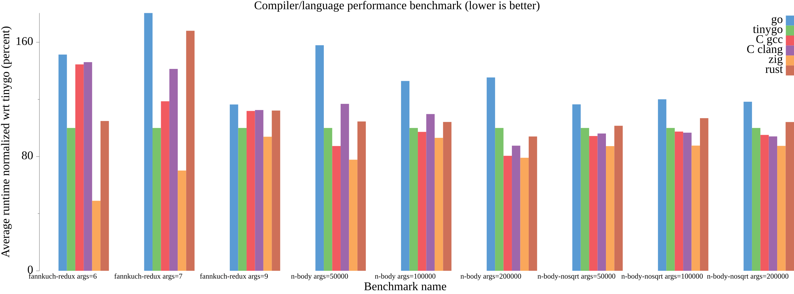

# tinybench
Benchmarks for comparing TinyGo's performance

## Benchmarks chosen and focus
- `fannkuch-redux`: Focused on integer operations on short arrays
- `n-body`: Floating point operations and usage of math library (sqrt)
    - `n-body-nosqrt`: Identical to above but replaces call to square-root math library function with a iterative solution. This benchmark shows the difference between C and Go math standard libraries. Go math library has more overhead for assembly implemented functions.
- `rsa-keygen`: Usage of crypto library for secure key generation. C version uses OpenSSL while Go version uses standard library. Focus on speed of modern available crypto libraries.



## Run Benchmarks
```sh
go test -bench=.

# Or to only run a certain test's benchmarks use expression "BenchmarkAll/<NAME OF TEST>:" 
go test -bench "BenchmarkAll/n-body:"  # You may need to escape the colon on windows powershell.
```

#### Generate benchmark image
Note the below command will not output results
```sh
go test -bench . | go run ./plot_/ -o benchmark.png
```


#### Output for 12th Gen Intel(R) Core(TM) i5-12400F

<details>
<summary>Click to display</summary>

```
$ go test -bench .
goos: linux
goarch: amd64
pkg: tinybench
cpu: 12th Gen Intel(R) Core(TM) i5-12400F
BenchmarkAll/fannkuch-redux:args=6/go-12             550           2412149 ns/op
BenchmarkAll/fannkuch-redux:args=6/tinygo-12       10000            873972 ns/op
BenchmarkAll/fannkuch-redux:args=6/C_gcc-12         2246           1775041 ns/op
BenchmarkAll/fannkuch-redux:args=6/C_clang-12       1464           1772509 ns/op
BenchmarkAll/fannkuch-redux:args=6/zig-12          10000            746182 ns/op
BenchmarkAll/fannkuch-redux:args=7/go-12             414           3369567 ns/op
BenchmarkAll/fannkuch-redux:args=7/tinygo-12        1875           1852835 ns/op
BenchmarkAll/fannkuch-redux:args=7/C_gcc-12         2888           2947870 ns/op
BenchmarkAll/fannkuch-redux:args=7/C_clang-12        586           2837630 ns/op
BenchmarkAll/fannkuch-redux:args=7/zig-12           3789           1650850 ns/op
BenchmarkAll/fannkuch-redux:args=9/go-12              74          16055816 ns/op
BenchmarkAll/fannkuch-redux:args=9/tinygo-12          90          13676753 ns/op
BenchmarkAll/fannkuch-redux:args=9/C_gcc-12           70          16950395 ns/op
BenchmarkAll/fannkuch-redux:args=9/C_clang-12         79          15332016 ns/op
BenchmarkAll/fannkuch-redux:args=9/zig-12             88          13811213 ns/op
BenchmarkAll/n-body:args=50000/go-12                 133           9214113 ns/op
BenchmarkAll/n-body:args=50000/tinygo-12             132           9594192 ns/op
BenchmarkAll/n-body:args=50000/C_gcc-12              177           8758373 ns/op
BenchmarkAll/n-body:args=50000/C_clang-12            135           9028504 ns/op
BenchmarkAll/n-body:args=50000/zig-12                164           7765784 ns/op
BenchmarkAll/n-body:args=100000/go-12                104          11116263 ns/op
BenchmarkAll/n-body:args=100000/tinygo-12            123          10675077 ns/op
BenchmarkAll/n-body:args=100000/C_gcc-12             100          10070047 ns/op
BenchmarkAll/n-body:args=100000/C_clang-12           127          11100669 ns/op
BenchmarkAll/n-body:args=100000/zig-12               100          10316933 ns/op
BenchmarkAll/n-body:args=200000/go-12                 85          14271753 ns/op
BenchmarkAll/n-body:args=200000/tinygo-12            100          11393334 ns/op
BenchmarkAll/n-body:args=200000/C_gcc-12             100          11410308 ns/op
BenchmarkAll/n-body:args=200000/C_clang-12           120           9987262 ns/op
BenchmarkAll/n-body:args=200000/zig-12               138          10829890 ns/op
BenchmarkAll/n-body-nosqrt:args=50000/go-12           80          14737588 ns/op
BenchmarkAll/n-body-nosqrt:args=50000/tinygo-12                       99          12510531 ns/op
BenchmarkAll/n-body-nosqrt:args=50000/C_gcc-12                       100          12396257 ns/op
BenchmarkAll/n-body-nosqrt:args=50000/C_clang-12                     100          12286344 ns/op
BenchmarkAll/n-body-nosqrt:args=50000/zig-12                         100          12298839 ns/op
BenchmarkAll/n-body-nosqrt:args=100000/go-12                          43          27673613 ns/op
BenchmarkAll/n-body-nosqrt:args=100000/tinygo-12                      45          22728467 ns/op
BenchmarkAll/n-body-nosqrt:args=100000/C_gcc-12                       54          21819778 ns/op
BenchmarkAll/n-body-nosqrt:args=100000/C_clang-12                     54          21854862 ns/op
BenchmarkAll/n-body-nosqrt:args=100000/zig-12                         55          20314202 ns/op
BenchmarkAll/n-body-nosqrt:args=200000/go-12                          21          53564741 ns/op
BenchmarkAll/n-body-nosqrt:args=200000/tinygo-12                      25          44958227 ns/op
BenchmarkAll/n-body-nosqrt:args=200000/C_gcc-12                       27          42993350 ns/op
BenchmarkAll/n-body-nosqrt:args=200000/C_clang-12                     26          42977987 ns/op
BenchmarkAll/n-body-nosqrt:args=200000/zig-12                         28          39861594 ns/op
BenchmarkAll/rsa-keygen:args=-s_512/go-12                            142           8086395 ns/op
BenchmarkAll/rsa-keygen:args=-s_512/tinygo-12                        100          10021873 ns/op
BenchmarkAll/rsa-keygen:args=-s_512/C_gcc-12                         133          10839615 ns/op
BenchmarkAll/rsa-keygen:args=-s_512/C_clang-12                       126          10817649 ns/op
BenchmarkAll/rsa-keygen:args=-s_1024/go-12                            79          13283009 ns/op
BenchmarkAll/rsa-keygen:args=-s_1024/tinygo-12                        64          24271934 ns/op
BenchmarkAll/rsa-keygen:args=-s_1024/C_gcc-12                        100          11437469 ns/op
BenchmarkAll/rsa-keygen:args=-s_1024/C_clang-12                      100          11645818 ns/op
PASS
ok      tinybench       195.491s
```

</details>

## Result Summary
- TinyGo is notably faster at integer number crunching.
- TinyGo and C go head-to-head on floating point math when not calling specialized functions such as `sqrt`. Go lags behind.
- OpenSSL is notably faster than Go's standard library at RSA key generation

## Add a benchmark
The way tinybench works is all directories with no `.` or `_` character (anywhere in name) in this repos' root directory are added to the benchmark corpus.
Within each of these directories a `c` and `go` folder is searched for and their code compiled and run automatically. Flags used for the compilers can be found in [`compilerflags_test.go`](./compiler_flags.go).

To add a new test follow these steps:

1. Creating a new top level folder with a descriptive name such as `rsa-keygen` with no `.` or `_` characters


2. Add an `args.txt` file to the folder with the OS arguments to the program and add a single line with an argument i.e: `-s 1024` (flag `s` with value `1024`).
    - Each line of this file will contain a benchmark case.

3. Create folders with the language you wish to test. Each will be run with arguments provided by `args.txt`. Each folder should contain a single file called `main.<extension>` where `<extension>` is the file extension of the language being teste.
    - `<benchmark-name>/go/main.go`: Will contain a `package main` project that is compiled for the benchmark.
    - `<benchmark-name>/c/main.c`: Contains the C source code for benchmark. Since linking is done via flags you must add your project's flags to `gccFlags` map.
    - `<benchmark-name>/zig/main.zig`: Contains the Zig source code for benchmark.
