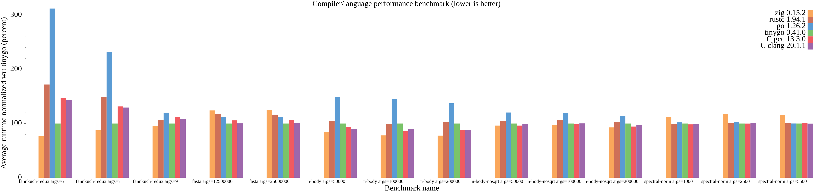
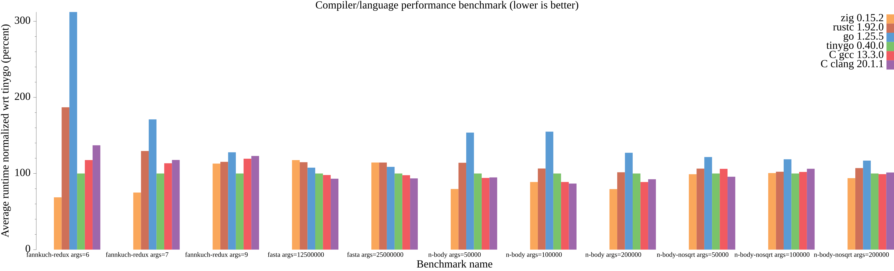
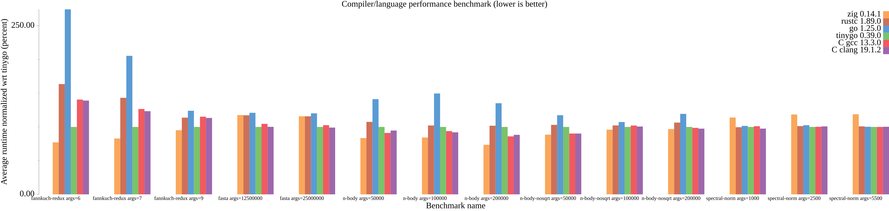

# Results

## TinyGo 0.41.0



### Output for 13th Gen Intel(R) Core(TM) i9-13900HX

<details>
<summary>Click to display</summary>

```
goos: linux
goarch: amd64
pkg: tinybench
cpu: 13th Gen Intel(R) Core(TM) i9-13900HX
BenchmarkAll
    bench_test.go:107: found compiler zig 0.15.2
    bench_test.go:107: found compiler rustc 1.94.1
    bench_test.go:107: found compiler go 1.26.2
    bench_test.go:107: found compiler tinygo 0.41.0
    bench_test.go:107: found compiler gcc 13.3.0
    bench_test.go:107: found compiler clang 20.1.1
    bench_test.go:109: looking for benchmarks in [fannkuch-redux fasta n-body n-body-nosqrt spectral-norm]
BenchmarkAll/fannkuch-redux:args=6/zig/zig
    bench_test.go:145: name="fannkuch-redux" compiler="zig" binarysize=2346896 version=0.15.2
BenchmarkAll/fannkuch-redux:args=6/zig/zig-32         	    1910	    704049 ns/op
BenchmarkAll/fannkuch-redux:args=7/zig/zig
BenchmarkAll/fannkuch-redux:args=7/zig/zig-32         	    1083	   1211104 ns/op
BenchmarkAll/fannkuch-redux:args=9/zig/zig
BenchmarkAll/fannkuch-redux:args=9/zig/zig-32         	      62	  19750567 ns/op
BenchmarkAll/fannkuch-redux:args=6/rust/rustc
    bench_test.go:145: name="fannkuch-redux" compiler="rustc" binarysize=3965024 version=1.94.1
BenchmarkAll/fannkuch-redux:args=6/rust/rustc-32      	     718	   1583939 ns/op
BenchmarkAll/fannkuch-redux:args=7/rust/rustc
BenchmarkAll/fannkuch-redux:args=7/rust/rustc-32      	     531	   2158237 ns/op
BenchmarkAll/fannkuch-redux:args=9/rust/rustc
BenchmarkAll/fannkuch-redux:args=9/rust/rustc-32      	      56	  22334613 ns/op
BenchmarkAll/fannkuch-redux:args=6/go/go
    bench_test.go:145: name="fannkuch-redux" compiler="go" binarysize=2421417 version=1.26.2
BenchmarkAll/fannkuch-redux:args=6/go/go-32           	     452	   2834369 ns/op
BenchmarkAll/fannkuch-redux:args=7/go/go
BenchmarkAll/fannkuch-redux:args=7/go/go-32           	     430	   3143527 ns/op
BenchmarkAll/fannkuch-redux:args=9/go/go
BenchmarkAll/fannkuch-redux:args=9/go/go-32           	      45	  23803733 ns/op
BenchmarkAll/fannkuch-redux:args=6/go/tinygo
    bench_test.go:145: name="fannkuch-redux" compiler="tinygo" binarysize=1453560 version=0.41.0
BenchmarkAll/fannkuch-redux:args=6/go/tinygo-32       	    1466	    861754 ns/op
BenchmarkAll/fannkuch-redux:args=7/go/tinygo
BenchmarkAll/fannkuch-redux:args=7/go/tinygo-32       	    1062	   1245314 ns/op
BenchmarkAll/fannkuch-redux:args=9/go/tinygo
BenchmarkAll/fannkuch-redux:args=9/go/tinygo-32       	      62	  20289556 ns/op
BenchmarkAll/fannkuch-redux:args=6/c/gcc
    bench_test.go:145: name="fannkuch-redux" compiler="gcc" binarysize=16368 version=13.3.0
BenchmarkAll/fannkuch-redux:args=6/c/gcc-32           	    1068	   1296959 ns/op
BenchmarkAll/fannkuch-redux:args=7/c/gcc
BenchmarkAll/fannkuch-redux:args=7/c/gcc-32           	     822	   1761420 ns/op
BenchmarkAll/fannkuch-redux:args=9/c/gcc
BenchmarkAll/fannkuch-redux:args=9/c/gcc-32           	      49	  22222570 ns/op
BenchmarkAll/fannkuch-redux:args=6/c/clang
    bench_test.go:145: name="fannkuch-redux" compiler="clang" binarysize=16368 version=20.1.1
BenchmarkAll/fannkuch-redux:args=6/c/clang-32         	     950	   1285562 ns/op
BenchmarkAll/fannkuch-redux:args=7/c/clang
BenchmarkAll/fannkuch-redux:args=7/c/clang-32         	     753	   1683488 ns/op
BenchmarkAll/fannkuch-redux:args=9/c/clang
BenchmarkAll/fannkuch-redux:args=9/c/clang-32         	      50	  21814319 ns/op
BenchmarkAll/fasta:args=12500000/zig/zig
    bench_test.go:145: name="fasta" compiler="zig" binarysize=2349008 version=0.15.2
BenchmarkAll/fasta:args=12500000/zig/zig-32           	       1	1607753661 ns/op
BenchmarkAll/fasta:args=25000000/zig/zig
BenchmarkAll/fasta:args=25000000/zig/zig-32           	       1	3185464088 ns/op
BenchmarkAll/fasta:args=12500000/rust/rustc
    bench_test.go:145: name="fasta" compiler="rustc" binarysize=3966016 version=1.94.1
BenchmarkAll/fasta:args=12500000/rust/rustc-32        	       1	1497231759 ns/op
BenchmarkAll/fasta:args=25000000/rust/rustc
BenchmarkAll/fasta:args=25000000/rust/rustc-32        	       1	2973599688 ns/op
BenchmarkAll/fasta:args=12500000/go/go
    bench_test.go:145: name="fasta" compiler="go" binarysize=2531101 version=1.26.2
BenchmarkAll/fasta:args=12500000/go/go-32             	       1	1433418281 ns/op
BenchmarkAll/fasta:args=25000000/go/go
BenchmarkAll/fasta:args=25000000/go/go-32             	       1	2851353848 ns/op
BenchmarkAll/fasta:args=12500000/go/tinygo
    bench_test.go:145: name="fasta" compiler="tinygo" binarysize=1586528 version=0.41.0
BenchmarkAll/fasta:args=12500000/go/tinygo-32         	       1	1288430108 ns/op
BenchmarkAll/fasta:args=25000000/go/tinygo
BenchmarkAll/fasta:args=25000000/go/tinygo-32         	       1	2556402064 ns/op
BenchmarkAll/fasta:args=12500000/c/gcc
    bench_test.go:145: name="fasta" compiler="gcc" binarysize=16312 version=13.3.0
BenchmarkAll/fasta:args=12500000/c/gcc-32             	       1	1364344071 ns/op
BenchmarkAll/fasta:args=25000000/c/gcc
BenchmarkAll/fasta:args=25000000/c/gcc-32             	       1	2694211497 ns/op
BenchmarkAll/fasta:args=12500000/c/clang
    bench_test.go:145: name="fasta" compiler="clang" binarysize=16280 version=20.1.1
BenchmarkAll/fasta:args=12500000/c/clang-32           	       1	1289586967 ns/op
BenchmarkAll/fasta:args=25000000/c/clang
BenchmarkAll/fasta:args=25000000/c/clang-32           	       1	2592023480 ns/op
BenchmarkAll/n-body:args=50000/zig/zig
    bench_test.go:145: name="n-body" compiler="zig" binarysize=2390408 version=0.15.2
BenchmarkAll/n-body:args=50000/zig/zig-32             	     224	   5539247 ns/op
BenchmarkAll/n-body:args=100000/zig/zig
BenchmarkAll/n-body:args=100000/zig/zig-32            	     186	   6535573 ns/op
BenchmarkAll/n-body:args=200000/zig/zig
BenchmarkAll/n-body:args=200000/zig/zig-32            	     100	  14023388 ns/op
BenchmarkAll/n-body:args=50000/rust/rustc
    bench_test.go:145: name="n-body" compiler="rustc" binarysize=3991560 version=1.94.1
BenchmarkAll/n-body:args=50000/rust/rustc-32          	     201	   7179079 ns/op
BenchmarkAll/n-body:args=100000/rust/rustc
BenchmarkAll/n-body:args=100000/rust/rustc-32         	     100	  12424845 ns/op
BenchmarkAll/n-body:args=200000/rust/rustc
BenchmarkAll/n-body:args=200000/rust/rustc-32         	     100	  16850741 ns/op
BenchmarkAll/n-body:args=50000/go/go
    bench_test.go:145: name="n-body" compiler="go" binarysize=2421227 version=1.26.2
BenchmarkAll/n-body:args=50000/go/go-32               	     132	   9711391 ns/op
BenchmarkAll/n-body:args=100000/go/go
BenchmarkAll/n-body:args=100000/go/go-32              	      81	  16266326 ns/op
BenchmarkAll/n-body:args=200000/go/go
BenchmarkAll/n-body:args=200000/go/go-32              	      51	  22688789 ns/op
BenchmarkAll/n-body:args=50000/go/tinygo
    bench_test.go:145: name="n-body" compiler="tinygo" binarysize=1461984 version=0.41.0
BenchmarkAll/n-body:args=50000/go/tinygo-32           	     229	   6520747 ns/op
BenchmarkAll/n-body:args=100000/go/tinygo
BenchmarkAll/n-body:args=100000/go/tinygo-32          	     100	  11417038 ns/op
BenchmarkAll/n-body:args=200000/go/tinygo
BenchmarkAll/n-body:args=200000/go/tinygo-32          	      92	  18121033 ns/op
BenchmarkAll/n-body:args=50000/c/gcc
    bench_test.go:145: name="n-body" compiler="gcc" binarysize=16440 version=13.3.0
BenchmarkAll/n-body:args=50000/c/gcc-32               	     236	   6025020 ns/op
BenchmarkAll/n-body:args=100000/c/gcc
BenchmarkAll/n-body:args=100000/c/gcc-32              	     126	   9147921 ns/op
BenchmarkAll/n-body:args=200000/c/gcc
BenchmarkAll/n-body:args=200000/c/gcc-32              	      80	  16277818 ns/op
BenchmarkAll/n-body:args=50000/c/clang
    bench_test.go:145: name="n-body" compiler="clang" binarysize=16464 version=20.1.1
BenchmarkAll/n-body:args=50000/c/clang-32             	     208	   6321665 ns/op
BenchmarkAll/n-body:args=100000/c/clang
BenchmarkAll/n-body:args=100000/c/clang-32            	     148	   9033902 ns/op
BenchmarkAll/n-body:args=200000/c/clang
BenchmarkAll/n-body:args=200000/c/clang-32            	      78	  16032121 ns/op
BenchmarkAll/n-body-nosqrt:args=50000/zig/zig
    bench_test.go:145: name="n-body-nosqrt" compiler="zig" binarysize=2395592 version=0.15.2
BenchmarkAll/n-body-nosqrt:args=50000/zig/zig-32      	      68	  19634691 ns/op
BenchmarkAll/n-body-nosqrt:args=100000/zig/zig
BenchmarkAll/n-body-nosqrt:args=100000/zig/zig-32     	      40	  30676909 ns/op
BenchmarkAll/n-body-nosqrt:args=200000/zig/zig
BenchmarkAll/n-body-nosqrt:args=200000/zig/zig-32     	      21	  52361460 ns/op
BenchmarkAll/n-body-nosqrt:args=50000/rust/rustc
    bench_test.go:145: name="n-body-nosqrt" compiler="rustc" binarysize=3991880 version=1.94.1
BenchmarkAll/n-body-nosqrt:args=50000/rust/rustc-32   	      57	  21293173 ns/op
BenchmarkAll/n-body-nosqrt:args=100000/rust/rustc
BenchmarkAll/n-body-nosqrt:args=100000/rust/rustc-32  	      31	  32284859 ns/op
BenchmarkAll/n-body-nosqrt:args=200000/rust/rustc
BenchmarkAll/n-body-nosqrt:args=200000/rust/rustc-32  	      20	  56829197 ns/op
BenchmarkAll/n-body-nosqrt:args=50000/go/go
    bench_test.go:145: name="n-body-nosqrt" compiler="go" binarysize=2421583 version=1.26.2
BenchmarkAll/n-body-nosqrt:args=50000/go/go-32        	      46	  24041545 ns/op
BenchmarkAll/n-body-nosqrt:args=100000/go/go
BenchmarkAll/n-body-nosqrt:args=100000/go/go-32       	      33	  33621892 ns/op
BenchmarkAll/n-body-nosqrt:args=200000/go/go
BenchmarkAll/n-body-nosqrt:args=200000/go/go-32       	      18	  64144683 ns/op
BenchmarkAll/n-body-nosqrt:args=50000/go/tinygo
    bench_test.go:145: name="n-body-nosqrt" compiler="tinygo" binarysize=1463000 version=0.41.0
BenchmarkAll/n-body-nosqrt:args=50000/go/tinygo-32    	      50	  21257101 ns/op
BenchmarkAll/n-body-nosqrt:args=100000/go/tinygo
BenchmarkAll/n-body-nosqrt:args=100000/go/tinygo-32   	      39	  31512749 ns/op
BenchmarkAll/n-body-nosqrt:args=200000/go/tinygo
BenchmarkAll/n-body-nosqrt:args=200000/go/tinygo-32   	      19	  57828791 ns/op
BenchmarkAll/n-body-nosqrt:args=50000/c/gcc
    bench_test.go:145: name="n-body-nosqrt" compiler="gcc" binarysize=16520 version=13.3.0
BenchmarkAll/n-body-nosqrt:args=50000/c/gcc-32        	      64	  19153547 ns/op
BenchmarkAll/n-body-nosqrt:args=100000/c/gcc
BenchmarkAll/n-body-nosqrt:args=100000/c/gcc-32       	      42	  28667000 ns/op
BenchmarkAll/n-body-nosqrt:args=200000/c/gcc
BenchmarkAll/n-body-nosqrt:args=200000/c/gcc-32       	      21	  52466652 ns/op
BenchmarkAll/n-body-nosqrt:args=50000/c/clang
    bench_test.go:145: name="n-body-nosqrt" compiler="clang" binarysize=16560 version=20.1.1
BenchmarkAll/n-body-nosqrt:args=50000/c/clang-32      	      56	  19038990 ns/op
BenchmarkAll/n-body-nosqrt:args=100000/c/clang
BenchmarkAll/n-body-nosqrt:args=100000/c/clang-32     	      34	  29885573 ns/op
BenchmarkAll/n-body-nosqrt:args=200000/c/clang
BenchmarkAll/n-body-nosqrt:args=200000/c/clang-32     	      22	  54103919 ns/op
BenchmarkAll/spectral-norm:args=1000/zig/zig
    bench_test.go:145: name="spectral-norm" compiler="zig" binarysize=2396472 version=0.15.2
BenchmarkAll/spectral-norm:args=1000/zig/zig-32       	      21	  53669827 ns/op
BenchmarkAll/spectral-norm:args=2500/zig/zig
BenchmarkAll/spectral-norm:args=2500/zig/zig-32       	       4	 315382190 ns/op
BenchmarkAll/spectral-norm:args=5500/zig/zig
BenchmarkAll/spectral-norm:args=5500/zig/zig-32       	       1	1488124566 ns/op
BenchmarkAll/spectral-norm:args=1000/rust/rustc
    bench_test.go:145: name="spectral-norm" compiler="rustc" binarysize=3987504 version=1.94.1
BenchmarkAll/spectral-norm:args=1000/rust/rustc-32    	      25	  46464182 ns/op
BenchmarkAll/spectral-norm:args=2500/rust/rustc
BenchmarkAll/spectral-norm:args=2500/rust/rustc-32    	       4	 271271803 ns/op
BenchmarkAll/spectral-norm:args=5500/rust/rustc
BenchmarkAll/spectral-norm:args=5500/rust/rustc-32    	       1	1285722952 ns/op
BenchmarkAll/spectral-norm:args=1000/go/go
    bench_test.go:145: name="spectral-norm" compiler="go" binarysize=2520385 version=1.26.2
BenchmarkAll/spectral-norm:args=1000/go/go-32         	      24	  48229432 ns/op
BenchmarkAll/spectral-norm:args=2500/go/go
BenchmarkAll/spectral-norm:args=2500/go/go-32         	       4	 273622371 ns/op
BenchmarkAll/spectral-norm:args=5500/go/go
BenchmarkAll/spectral-norm:args=5500/go/go-32         	       1	1291948675 ns/op
BenchmarkAll/spectral-norm:args=1000/go/tinygo
    bench_test.go:145: name="spectral-norm" compiler="tinygo" binarysize=1570176 version=0.41.0
BenchmarkAll/spectral-norm:args=1000/go/tinygo-32     	      22	  46675808 ns/op
BenchmarkAll/spectral-norm:args=2500/go/tinygo
BenchmarkAll/spectral-norm:args=2500/go/tinygo-32     	       4	 269387238 ns/op
BenchmarkAll/spectral-norm:args=5500/go/tinygo
BenchmarkAll/spectral-norm:args=5500/go/tinygo-32     	       1	1281262443 ns/op
BenchmarkAll/spectral-norm:args=1000/c/gcc
    bench_test.go:145: name="spectral-norm" compiler="gcc" binarysize=16200 version=13.3.0
BenchmarkAll/spectral-norm:args=1000/c/gcc-32         	      25	  46203880 ns/op
BenchmarkAll/spectral-norm:args=2500/c/gcc
BenchmarkAll/spectral-norm:args=2500/c/gcc-32         	       4	 269752832 ns/op
BenchmarkAll/spectral-norm:args=5500/c/gcc
BenchmarkAll/spectral-norm:args=5500/c/gcc-32         	       1	1281434417 ns/op
BenchmarkAll/spectral-norm:args=1000/c/clang
    bench_test.go:145: name="spectral-norm" compiler="clang" binarysize=16224 version=20.1.1
BenchmarkAll/spectral-norm:args=1000/c/clang-32       	      25	  49254074 ns/op
BenchmarkAll/spectral-norm:args=2500/c/clang
BenchmarkAll/spectral-norm:args=2500/c/clang-32       	       4	 266206463 ns/op
BenchmarkAll/spectral-norm:args=5500/c/clang
BenchmarkAll/spectral-norm:args=5500/c/clang-32       	       1	1299523925 ns/op
PASS
ok  	tinybench	189.496s
```
</details>

## TinyGo 0.40.0



### Output for 13th Gen Intel(R) Core(TM) i9-13900HX

<details>
<summary>Click to display</summary>

```
goos: linux
goarch: amd64
pkg: tinybench
cpu: 13th Gen Intel(R) Core(TM) i9-13900HX
BenchmarkAll
    bench_test.go:107: found compiler zig 0.15.2
    bench_test.go:107: found compiler rustc 1.92.0
    bench_test.go:107: found compiler go 1.25.5
    bench_test.go:107: found compiler tinygo 0.40.0
    bench_test.go:107: found compiler gcc 13.3.0
    bench_test.go:107: found compiler clang 20.1.1
    bench_test.go:109: looking for benchmarks in [fannkuch-redux fasta n-body n-body-nosqrt spectral-norm]
BenchmarkAll/fannkuch-redux:args=6/zig/zig
    bench_test.go:145: name="fannkuch-redux" compiler="zig" binarysize=2346896 version=0.15.2
BenchmarkAll/fannkuch-redux:args=6/zig/zig-32         	    1819	    633574 ns/op
BenchmarkAll/fannkuch-redux:args=7/zig/zig
BenchmarkAll/fannkuch-redux:args=7/zig/zig-32         	    1226	    943909 ns/op
BenchmarkAll/fannkuch-redux:args=9/zig/zig
BenchmarkAll/fannkuch-redux:args=9/zig/zig-32         	      62	  17605294 ns/op
BenchmarkAll/fannkuch-redux:args=6/rust/rustc
    bench_test.go:145: name="fannkuch-redux" compiler="rustc" binarysize=3888696 version=1.92.0
BenchmarkAll/fannkuch-redux:args=6/rust/rustc-32      	     880	   1314690 ns/op
BenchmarkAll/fannkuch-redux:args=7/rust/rustc
BenchmarkAll/fannkuch-redux:args=7/rust/rustc-32      	     728	   1620621 ns/op
BenchmarkAll/fannkuch-redux:args=9/rust/rustc
BenchmarkAll/fannkuch-redux:args=9/rust/rustc-32      	      46	  21893230 ns/op
BenchmarkAll/fannkuch-redux:args=6/go/go
    bench_test.go:145: name="fannkuch-redux" compiler="go" binarysize=2289991 version=1.25.5
BenchmarkAll/fannkuch-redux:args=6/go/go-32           	     542	   2068653 ns/op
BenchmarkAll/fannkuch-redux:args=7/go/go
BenchmarkAll/fannkuch-redux:args=7/go/go-32           	     482	   2390357 ns/op
BenchmarkAll/fannkuch-redux:args=9/go/go
BenchmarkAll/fannkuch-redux:args=9/go/go-32           	      52	  23616612 ns/op
BenchmarkAll/fannkuch-redux:args=6/go/tinygo
    bench_test.go:145: name="fannkuch-redux" compiler="tinygo" binarysize=1544592 version=0.40.0
BenchmarkAll/fannkuch-redux:args=6/go/tinygo-32       	    1513	    793179 ns/op
BenchmarkAll/fannkuch-redux:args=7/go/tinygo
BenchmarkAll/fannkuch-redux:args=7/go/tinygo-32       	    1096	   1078705 ns/op
BenchmarkAll/fannkuch-redux:args=9/go/tinygo
BenchmarkAll/fannkuch-redux:args=9/go/tinygo-32       	      52	  19505780 ns/op
BenchmarkAll/fannkuch-redux:args=6/c/gcc
    bench_test.go:145: name="fannkuch-redux" compiler="gcc" binarysize=16368 version=13.3.0
BenchmarkAll/fannkuch-redux:args=6/c/gcc-32           	    1093	   1017939 ns/op
BenchmarkAll/fannkuch-redux:args=7/c/gcc
BenchmarkAll/fannkuch-redux:args=7/c/gcc-32           	     850	   1360082 ns/op
BenchmarkAll/fannkuch-redux:args=9/c/gcc
BenchmarkAll/fannkuch-redux:args=9/c/gcc-32           	      55	  22618233 ns/op
BenchmarkAll/fannkuch-redux:args=6/c/clang
    bench_test.go:145: name="fannkuch-redux" compiler="clang" binarysize=16360 version=20.1.1
BenchmarkAll/fannkuch-redux:args=6/c/clang-32         	    1065	   1040170 ns/op
BenchmarkAll/fannkuch-redux:args=7/c/clang
BenchmarkAll/fannkuch-redux:args=7/c/clang-32         	     945	   1377921 ns/op
BenchmarkAll/fannkuch-redux:args=9/c/clang
BenchmarkAll/fannkuch-redux:args=9/c/clang-32         	      57	  21806333 ns/op
BenchmarkAll/fasta:args=12500000/zig/zig
    bench_test.go:145: name="fasta" compiler="zig" binarysize=2349008 version=0.15.2
BenchmarkAll/fasta:args=12500000/zig/zig-32           	       1	1617719307 ns/op
BenchmarkAll/fasta:args=25000000/zig/zig
BenchmarkAll/fasta:args=25000000/zig/zig-32           	       1	3186264922 ns/op
BenchmarkAll/fasta:args=12500000/rust/rustc
    bench_test.go:145: name="fasta" compiler="rustc" binarysize=3889104 version=1.92.0
BenchmarkAll/fasta:args=12500000/rust/rustc-32        	       1	1594440529 ns/op
BenchmarkAll/fasta:args=25000000/rust/rustc
BenchmarkAll/fasta:args=25000000/rust/rustc-32        	       1	3168475590 ns/op
BenchmarkAll/fasta:args=12500000/go/go
    bench_test.go:145: name="fasta" compiler="go" binarysize=2399137 version=1.25.5
BenchmarkAll/fasta:args=12500000/go/go-32             	       1	1504124374 ns/op
BenchmarkAll/fasta:args=25000000/go/go
BenchmarkAll/fasta:args=25000000/go/go-32             	       1	2982303152 ns/op
BenchmarkAll/fasta:args=12500000/go/tinygo
    bench_test.go:145: name="fasta" compiler="tinygo" binarysize=1675560 version=0.40.0
BenchmarkAll/fasta:args=12500000/go/tinygo-32         	       1	1394160337 ns/op
BenchmarkAll/fasta:args=25000000/go/tinygo
BenchmarkAll/fasta:args=25000000/go/tinygo-32         	       1	2770826724 ns/op
BenchmarkAll/fasta:args=12500000/c/gcc
    bench_test.go:145: name="fasta" compiler="gcc" binarysize=16304 version=13.3.0
BenchmarkAll/fasta:args=12500000/c/gcc-32             	       1	1361580724 ns/op
BenchmarkAll/fasta:args=25000000/c/gcc
BenchmarkAll/fasta:args=25000000/c/gcc-32             	       1	2720601685 ns/op
BenchmarkAll/fasta:args=12500000/c/clang
    bench_test.go:145: name="fasta" compiler="clang" binarysize=16280 version=20.1.1
BenchmarkAll/fasta:args=12500000/c/clang-32           	       1	1291232025 ns/op
BenchmarkAll/fasta:args=25000000/c/clang
BenchmarkAll/fasta:args=25000000/c/clang-32           	       1	2583970999 ns/op
BenchmarkAll/n-body:args=50000/zig/zig
    bench_test.go:145: name="n-body" compiler="zig" binarysize=2390408 version=0.15.2
BenchmarkAll/n-body:args=50000/zig/zig-32             	     237	   4847365 ns/op
BenchmarkAll/n-body:args=100000/zig/zig
BenchmarkAll/n-body:args=100000/zig/zig-32            	     163	   7811627 ns/op
BenchmarkAll/n-body:args=200000/zig/zig
BenchmarkAll/n-body:args=200000/zig/zig-32            	      97	  11981283 ns/op
BenchmarkAll/n-body:args=50000/rust/rustc
    bench_test.go:145: name="n-body" compiler="rustc" binarysize=3915288 version=1.92.0
BenchmarkAll/n-body:args=50000/rust/rustc-32          	     205	   6111009 ns/op
BenchmarkAll/n-body:args=100000/rust/rustc
BenchmarkAll/n-body:args=100000/rust/rustc-32         	     126	   9774151 ns/op
BenchmarkAll/n-body:args=200000/rust/rustc
BenchmarkAll/n-body:args=200000/rust/rustc-32         	      87	  16127199 ns/op
BenchmarkAll/n-body:args=50000/go/go
    bench_test.go:145: name="n-body" compiler="go" binarysize=2289681 version=1.25.5
BenchmarkAll/n-body:args=50000/go/go-32               	     141	   8709717 ns/op
BenchmarkAll/n-body:args=100000/go/go
BenchmarkAll/n-body:args=100000/go/go-32              	      86	  13904413 ns/op
BenchmarkAll/n-body:args=200000/go/go
BenchmarkAll/n-body:args=200000/go/go-32              	      44	  23634493 ns/op
BenchmarkAll/n-body:args=50000/go/tinygo
    bench_test.go:145: name="n-body" compiler="tinygo" binarysize=1550496 version=0.40.0
BenchmarkAll/n-body:args=50000/go/tinygo-32           	     202	   5709919 ns/op
BenchmarkAll/n-body:args=100000/go/tinygo
BenchmarkAll/n-body:args=100000/go/tinygo-32          	     130	   9230407 ns/op
BenchmarkAll/n-body:args=200000/go/tinygo
BenchmarkAll/n-body:args=200000/go/tinygo-32          	      63	  16238671 ns/op
BenchmarkAll/n-body:args=50000/c/gcc
    bench_test.go:145: name="n-body" compiler="gcc" binarysize=16440 version=13.3.0
BenchmarkAll/n-body:args=50000/c/gcc-32               	     267	   4944799 ns/op
BenchmarkAll/n-body:args=100000/c/gcc
BenchmarkAll/n-body:args=100000/c/gcc-32              	     152	   7831867 ns/op
BenchmarkAll/n-body:args=200000/c/gcc
BenchmarkAll/n-body:args=200000/c/gcc-32              	     100	  14110339 ns/op
BenchmarkAll/n-body:args=50000/c/clang
    bench_test.go:145: name="n-body" compiler="clang" binarysize=16456 version=20.1.1
BenchmarkAll/n-body:args=50000/c/clang-32             	     246	   5034170 ns/op
BenchmarkAll/n-body:args=100000/c/clang
BenchmarkAll/n-body:args=100000/c/clang-32            	     151	   8207021 ns/op
BenchmarkAll/n-body:args=200000/c/clang
BenchmarkAll/n-body:args=200000/c/clang-32            	     100	  14123126 ns/op
BenchmarkAll/n-body-nosqrt:args=50000/zig/zig
    bench_test.go:145: name="n-body-nosqrt" compiler="zig" binarysize=2395592 version=0.15.2
BenchmarkAll/n-body-nosqrt:args=50000/zig/zig-32      	      62	  17324663 ns/op
BenchmarkAll/n-body-nosqrt:args=100000/zig/zig
BenchmarkAll/n-body-nosqrt:args=100000/zig/zig-32     	      40	  27622738 ns/op
BenchmarkAll/n-body-nosqrt:args=200000/zig/zig
BenchmarkAll/n-body-nosqrt:args=200000/zig/zig-32     	      22	  50589389 ns/op
BenchmarkAll/n-body-nosqrt:args=50000/rust/rustc
    bench_test.go:145: name="n-body-nosqrt" compiler="rustc" binarysize=3915576 version=1.92.0
BenchmarkAll/n-body-nosqrt:args=50000/rust/rustc-32   	      51	  20447674 ns/op
BenchmarkAll/n-body-nosqrt:args=100000/rust/rustc
BenchmarkAll/n-body-nosqrt:args=100000/rust/rustc-32  	      34	  31766297 ns/op
BenchmarkAll/n-body-nosqrt:args=200000/rust/rustc
BenchmarkAll/n-body-nosqrt:args=200000/rust/rustc-32  	      19	  58215653 ns/op
BenchmarkAll/n-body-nosqrt:args=50000/go/go
    bench_test.go:145: name="n-body-nosqrt" compiler="go" binarysize=2289989 version=1.25.5
BenchmarkAll/n-body-nosqrt:args=50000/go/go-32        	      45	  23149709 ns/op
BenchmarkAll/n-body-nosqrt:args=100000/go/go
BenchmarkAll/n-body-nosqrt:args=100000/go/go-32       	      34	  35107568 ns/op
BenchmarkAll/n-body-nosqrt:args=200000/go/go
BenchmarkAll/n-body-nosqrt:args=200000/go/go-32       	      19	  63521325 ns/op
BenchmarkAll/n-body-nosqrt:args=50000/go/tinygo
    bench_test.go:145: name="n-body-nosqrt" compiler="tinygo" binarysize=1551520 version=0.40.0
BenchmarkAll/n-body-nosqrt:args=50000/go/tinygo-32    	      54	  19736992 ns/op
BenchmarkAll/n-body-nosqrt:args=100000/go/tinygo
BenchmarkAll/n-body-nosqrt:args=100000/go/tinygo-32   	      33	  31188916 ns/op
BenchmarkAll/n-body-nosqrt:args=200000/go/tinygo
BenchmarkAll/n-body-nosqrt:args=200000/go/tinygo-32   	      20	  56116773 ns/op
BenchmarkAll/n-body-nosqrt:args=50000/c/gcc
    bench_test.go:145: name="n-body-nosqrt" compiler="gcc" binarysize=16520 version=13.3.0
BenchmarkAll/n-body-nosqrt:args=50000/c/gcc-32        	      63	  18169606 ns/op
BenchmarkAll/n-body-nosqrt:args=100000/c/gcc
BenchmarkAll/n-body-nosqrt:args=100000/c/gcc-32       	      36	  28335468 ns/op
BenchmarkAll/n-body-nosqrt:args=200000/c/gcc
BenchmarkAll/n-body-nosqrt:args=200000/c/gcc-32       	      21	  53150026 ns/op
BenchmarkAll/n-body-nosqrt:args=50000/c/clang
    bench_test.go:145: name="n-body-nosqrt" compiler="clang" binarysize=16552 version=20.1.1
BenchmarkAll/n-body-nosqrt:args=50000/c/clang-32      	      85	  18488146 ns/op
BenchmarkAll/n-body-nosqrt:args=100000/c/clang
BenchmarkAll/n-body-nosqrt:args=100000/c/clang-32     	      43	  29431368 ns/op
BenchmarkAll/n-body-nosqrt:args=200000/c/clang
BenchmarkAll/n-body-nosqrt:args=200000/c/clang-32     	      22	  54315599 ns/op
BenchmarkAll/spectral-norm:args=1000/zig/zig
    bench_test.go:145: name="spectral-norm" compiler="zig" binarysize=2396472 version=0.15.2
BenchmarkAll/spectral-norm:args=1000/zig/zig-32       	      20	  52063787 ns/op
BenchmarkAll/spectral-norm:args=2500/zig/zig
BenchmarkAll/spectral-norm:args=2500/zig/zig-32       	       4	 311235497 ns/op
BenchmarkAll/spectral-norm:args=5500/zig/zig
BenchmarkAll/spectral-norm:args=5500/zig/zig-32       	       1	1492319271 ns/op
BenchmarkAll/spectral-norm:args=1000/rust/rustc
    bench_test.go:145: name="spectral-norm" compiler="rustc" binarysize=3910832 version=1.92.0
BenchmarkAll/spectral-norm:args=1000/rust/rustc-32    	      24	  47602517 ns/op
BenchmarkAll/spectral-norm:args=2500/rust/rustc
BenchmarkAll/spectral-norm:args=2500/rust/rustc-32    	       4	 271072631 ns/op
BenchmarkAll/spectral-norm:args=5500/rust/rustc
BenchmarkAll/spectral-norm:args=5500/rust/rustc-32    	       1	1283657633 ns/op
BenchmarkAll/spectral-norm:args=1000/go/go
    bench_test.go:145: name="spectral-norm" compiler="go" binarysize=2388325 version=1.25.5
BenchmarkAll/spectral-norm:args=1000/go/go-32         	      25	  46605145 ns/op
BenchmarkAll/spectral-norm:args=2500/go/go
BenchmarkAll/spectral-norm:args=2500/go/go-32         	       4	 271363640 ns/op
BenchmarkAll/spectral-norm:args=5500/go/go
BenchmarkAll/spectral-norm:args=5500/go/go-32         	       1	1298903985 ns/op
BenchmarkAll/spectral-norm:args=1000/go/tinygo
    bench_test.go:145: name="spectral-norm" compiler="tinygo" binarysize=1657552 version=0.40.0
BenchmarkAll/spectral-norm:args=1000/go/tinygo-32     	      26	  46597931 ns/op
BenchmarkAll/spectral-norm:args=2500/go/tinygo
BenchmarkAll/spectral-norm:args=2500/go/tinygo-32     	       4	 267115876 ns/op
BenchmarkAll/spectral-norm:args=5500/go/tinygo
BenchmarkAll/spectral-norm:args=5500/go/tinygo-32     	       1	1283194956 ns/op
BenchmarkAll/spectral-norm:args=1000/c/gcc
    bench_test.go:145: name="spectral-norm" compiler="gcc" binarysize=16200 version=13.3.0
BenchmarkAll/spectral-norm:args=1000/c/gcc-32         	      25	  45995812 ns/op
BenchmarkAll/spectral-norm:args=2500/c/gcc
BenchmarkAll/spectral-norm:args=2500/c/gcc-32         	       4	 267731414 ns/op
BenchmarkAll/spectral-norm:args=5500/c/gcc
BenchmarkAll/spectral-norm:args=5500/c/gcc-32         	       1	1281269908 ns/op
BenchmarkAll/spectral-norm:args=1000/c/clang
    bench_test.go:145: name="spectral-norm" compiler="clang" binarysize=16216 version=20.1.1
BenchmarkAll/spectral-norm:args=1000/c/clang-32       	      25	  48064027 ns/op
BenchmarkAll/spectral-norm:args=2500/c/clang
BenchmarkAll/spectral-norm:args=2500/c/clang-32       	       4	 267039126 ns/op
BenchmarkAll/spectral-norm:args=5500/c/clang
BenchmarkAll/spectral-norm:args=5500/c/clang-32       	       1	1295094384 ns/op
PASS
ok  	tinybench	180.529s
```

</details>

## TinyGo 0.39.0



### Output for 13th Gen Intel(R) Core(TM) i9-13900HX

<details>
<summary>Click to display</summary>

```
goos: linux
goarch: amd64
pkg: tinybench
cpu: 13th Gen Intel(R) Core(TM) i9-13900HX
BenchmarkAll
    bench_test.go:107: found compiler zig 0.14.1
    bench_test.go:107: found compiler rustc 1.89.0
    bench_test.go:107: found compiler go 1.25.0
    bench_test.go:107: found compiler tinygo 0.39.0
    bench_test.go:107: found compiler gcc 13.3.0
    bench_test.go:107: found compiler clang 19.1.2
    bench_test.go:109: looking for benchmarks in [fannkuch-redux fasta n-body n-body-nosqrt spectral-norm]
BenchmarkAll/fannkuch-redux:args=6/zig/zig
    bench_test.go:145: name="fannkuch-redux" compiler="zig" binarysize=2704104 version=0.14.1
BenchmarkAll/fannkuch-redux:args=6/zig/zig-32         	    2362	    589872 ns/op
BenchmarkAll/fannkuch-redux:args=7/zig/zig
BenchmarkAll/fannkuch-redux:args=7/zig/zig-32         	    1464	    896911 ns/op
BenchmarkAll/fannkuch-redux:args=9/zig/zig
BenchmarkAll/fannkuch-redux:args=9/zig/zig-32         	      62	  18602938 ns/op
BenchmarkAll/fannkuch-redux:args=6/rust/rustc
    bench_test.go:145: name="fannkuch-redux" compiler="rustc" binarysize=3831744 version=1.89.0
BenchmarkAll/fannkuch-redux:args=6/rust/rustc-32      	     895	   1275563 ns/op
BenchmarkAll/fannkuch-redux:args=7/rust/rustc
BenchmarkAll/fannkuch-redux:args=7/rust/rustc-32      	     780	   1543351 ns/op
BenchmarkAll/fannkuch-redux:args=9/rust/rustc
BenchmarkAll/fannkuch-redux:args=9/rust/rustc-32      	      49	  22055124 ns/op
BenchmarkAll/fannkuch-redux:args=6/go/go
    bench_test.go:145: name="fannkuch-redux" compiler="go" binarysize=2289531 version=1.25.0
BenchmarkAll/fannkuch-redux:args=6/go/go-32           	     558	   1970670 ns/op
BenchmarkAll/fannkuch-redux:args=7/go/go
BenchmarkAll/fannkuch-redux:args=7/go/go-32           	     529	   2261376 ns/op
BenchmarkAll/fannkuch-redux:args=9/go/go
BenchmarkAll/fannkuch-redux:args=9/go/go-32           	      49	  22912619 ns/op
BenchmarkAll/fannkuch-redux:args=6/go/tinygo
    bench_test.go:145: name="fannkuch-redux" compiler="tinygo" binarysize=1557096 version=0.39.0
BenchmarkAll/fannkuch-redux:args=6/go/tinygo-32       	    2100	    746237 ns/op
BenchmarkAll/fannkuch-redux:args=7/go/tinygo
BenchmarkAll/fannkuch-redux:args=7/go/tinygo-32       	    1174	    999528 ns/op
BenchmarkAll/fannkuch-redux:args=9/go/tinygo
BenchmarkAll/fannkuch-redux:args=9/go/tinygo-32       	      52	  19675375 ns/op
BenchmarkAll/fannkuch-redux:args=6/c/gcc
    bench_test.go:145: name="fannkuch-redux" compiler="gcc" binarysize=16368 version=13.3.0
BenchmarkAll/fannkuch-redux:args=6/c/gcc-32           	    1326	   1027617 ns/op
BenchmarkAll/fannkuch-redux:args=7/c/gcc
BenchmarkAll/fannkuch-redux:args=7/c/gcc-32           	     866	   1296070 ns/op
BenchmarkAll/fannkuch-redux:args=9/c/gcc
BenchmarkAll/fannkuch-redux:args=9/c/gcc-32           	      56	  21448346 ns/op
BenchmarkAll/fannkuch-redux:args=6/c/clang
    bench_test.go:145: name="fannkuch-redux" compiler="clang" binarysize=16360 version=19.1.2
BenchmarkAll/fannkuch-redux:args=6/c/clang-32         	    1377	   1011635 ns/op
BenchmarkAll/fannkuch-redux:args=7/c/clang
BenchmarkAll/fannkuch-redux:args=7/c/clang-32         	     891	   1321761 ns/op
BenchmarkAll/fannkuch-redux:args=9/c/clang
BenchmarkAll/fannkuch-redux:args=9/c/clang-32         	      49	  21702280 ns/op
BenchmarkAll/fasta:args=12500000/zig/zig
    bench_test.go:145: name="fasta" compiler="zig" binarysize=2696784 version=0.14.1
BenchmarkAll/fasta:args=12500000/zig/zig-32           	       1	1524150003 ns/op
BenchmarkAll/fasta:args=25000000/zig/zig
BenchmarkAll/fasta:args=25000000/zig/zig-32           	       1	3037476597 ns/op
BenchmarkAll/fasta:args=12500000/rust/rustc
    bench_test.go:145: name="fasta" compiler="rustc" binarysize=3828128 version=1.89.0
BenchmarkAll/fasta:args=12500000/rust/rustc-32        	       1	1532275884 ns/op
BenchmarkAll/fasta:args=25000000/rust/rustc
BenchmarkAll/fasta:args=25000000/rust/rustc-32        	       1	3036528131 ns/op
BenchmarkAll/fasta:args=12500000/go/go
    bench_test.go:145: name="fasta" compiler="go" binarysize=2398797 version=1.25.0
BenchmarkAll/fasta:args=12500000/go/go-32             	       1	1583442300 ns/op
BenchmarkAll/fasta:args=25000000/go/go
BenchmarkAll/fasta:args=25000000/go/go-32             	       1	3149974285 ns/op
BenchmarkAll/fasta:args=12500000/go/tinygo
    bench_test.go:145: name="fasta" compiler="tinygo" binarysize=1687976 version=0.39.0
BenchmarkAll/fasta:args=12500000/go/tinygo-32         	       1	1316645685 ns/op
BenchmarkAll/fasta:args=25000000/go/tinygo
BenchmarkAll/fasta:args=25000000/go/tinygo-32         	       1	2626110434 ns/op
BenchmarkAll/fasta:args=12500000/c/gcc
    bench_test.go:145: name="fasta" compiler="gcc" binarysize=16304 version=13.3.0
BenchmarkAll/fasta:args=12500000/c/gcc-32             	       1	1356266601 ns/op
BenchmarkAll/fasta:args=25000000/c/gcc
BenchmarkAll/fasta:args=25000000/c/gcc-32             	       1	2699408160 ns/op
BenchmarkAll/fasta:args=12500000/c/clang
    bench_test.go:145: name="fasta" compiler="clang" binarysize=16280 version=19.1.2
BenchmarkAll/fasta:args=12500000/c/clang-32           	       1	1299334656 ns/op
BenchmarkAll/fasta:args=25000000/c/clang
BenchmarkAll/fasta:args=25000000/c/clang-32           	       1	2604749992 ns/op
BenchmarkAll/n-body:args=50000/zig/zig
    bench_test.go:145: name="n-body" compiler="zig" binarysize=2740216 version=0.14.1
BenchmarkAll/n-body:args=50000/zig/zig-32             	     242	   4712175 ns/op
BenchmarkAll/n-body:args=100000/zig/zig
BenchmarkAll/n-body:args=100000/zig/zig-32            	     160	   7140395 ns/op
BenchmarkAll/n-body:args=200000/zig/zig
BenchmarkAll/n-body:args=200000/zig/zig-32            	      90	  11711149 ns/op
BenchmarkAll/n-body:args=50000/rust/rustc
    bench_test.go:145: name="n-body" compiler="rustc" binarysize=3858208 version=1.89.0
BenchmarkAll/n-body:args=50000/rust/rustc-32          	     196	   6090737 ns/op
BenchmarkAll/n-body:args=100000/rust/rustc
BenchmarkAll/n-body:args=100000/rust/rustc-32         	     130	   8720167 ns/op
BenchmarkAll/n-body:args=200000/rust/rustc
BenchmarkAll/n-body:args=200000/rust/rustc-32         	      96	  15805209 ns/op
BenchmarkAll/n-body:args=50000/go/go
    bench_test.go:145: name="n-body" compiler="go" binarysize=2285005 version=1.25.0
BenchmarkAll/n-body:args=50000/go/go-32               	     146	   8023736 ns/op
BenchmarkAll/n-body:args=100000/go/go
BenchmarkAll/n-body:args=100000/go/go-32              	     100	  12933648 ns/op
BenchmarkAll/n-body:args=200000/go/go
BenchmarkAll/n-body:args=200000/go/go-32              	      48	  21046390 ns/op
BenchmarkAll/n-body:args=50000/go/tinygo
    bench_test.go:145: name="n-body" compiler="tinygo" binarysize=1561656 version=0.39.0
BenchmarkAll/n-body:args=50000/go/tinygo-32           	     207	   5325195 ns/op
BenchmarkAll/n-body:args=100000/go/tinygo
BenchmarkAll/n-body:args=100000/go/tinygo-32          	     128	   9047142 ns/op
BenchmarkAll/n-body:args=200000/go/tinygo
BenchmarkAll/n-body:args=200000/go/tinygo-32          	      75	  15570086 ns/op
BenchmarkAll/n-body:args=50000/c/gcc
    bench_test.go:145: name="n-body" compiler="gcc" binarysize=16440 version=13.3.0
BenchmarkAll/n-body:args=50000/c/gcc-32               	     249	   5338379 ns/op
BenchmarkAll/n-body:args=100000/c/gcc
BenchmarkAll/n-body:args=100000/c/gcc-32              	     144	   8135632 ns/op
BenchmarkAll/n-body:args=200000/c/gcc
BenchmarkAll/n-body:args=200000/c/gcc-32              	      79	  13876539 ns/op
BenchmarkAll/n-body:args=50000/c/clang
    bench_test.go:145: name="n-body" compiler="clang" binarysize=16456 version=19.1.2
BenchmarkAll/n-body:args=50000/c/clang-32             	     225	   5335736 ns/op
BenchmarkAll/n-body:args=100000/c/clang
BenchmarkAll/n-body:args=100000/c/clang-32            	     148	   7905387 ns/op
BenchmarkAll/n-body:args=200000/c/clang
BenchmarkAll/n-body:args=200000/c/clang-32            	      81	  14081306 ns/op
BenchmarkAll/n-body-nosqrt:args=50000/zig/zig
    bench_test.go:145: name="n-body-nosqrt" compiler="zig" binarysize=2746392 version=0.14.1
BenchmarkAll/n-body-nosqrt:args=50000/zig/zig-32      	      82	  18087996 ns/op
BenchmarkAll/n-body-nosqrt:args=100000/zig/zig
BenchmarkAll/n-body-nosqrt:args=100000/zig/zig-32     	      39	  28243037 ns/op
BenchmarkAll/n-body-nosqrt:args=200000/zig/zig
BenchmarkAll/n-body-nosqrt:args=200000/zig/zig-32     	      22	  51154883 ns/op
BenchmarkAll/n-body-nosqrt:args=50000/rust/rustc
    bench_test.go:145: name="n-body-nosqrt" compiler="rustc" binarysize=3858208 version=1.89.0
BenchmarkAll/n-body-nosqrt:args=50000/rust/rustc-32   	      57	  18477115 ns/op
BenchmarkAll/n-body-nosqrt:args=100000/rust/rustc
BenchmarkAll/n-body-nosqrt:args=100000/rust/rustc-32  	      37	  30400709 ns/op
BenchmarkAll/n-body-nosqrt:args=200000/rust/rustc
BenchmarkAll/n-body-nosqrt:args=200000/rust/rustc-32  	      19	  57761646 ns/op
BenchmarkAll/n-body-nosqrt:args=50000/go/go
    bench_test.go:145: name="n-body-nosqrt" compiler="go" binarysize=2289585 version=1.25.0
BenchmarkAll/n-body-nosqrt:args=50000/go/go-32        	      60	  23582455 ns/op
BenchmarkAll/n-body-nosqrt:args=100000/go/go
BenchmarkAll/n-body-nosqrt:args=100000/go/go-32       	      34	  33174511 ns/op
BenchmarkAll/n-body-nosqrt:args=200000/go/go
BenchmarkAll/n-body-nosqrt:args=200000/go/go-32       	      19	  66183002 ns/op
BenchmarkAll/n-body-nosqrt:args=50000/go/tinygo
    bench_test.go:145: name="n-body-nosqrt" compiler="tinygo" binarysize=1562656 version=0.39.0
BenchmarkAll/n-body-nosqrt:args=50000/go/tinygo-32    	      55	  20002813 ns/op
BenchmarkAll/n-body-nosqrt:args=100000/go/tinygo
BenchmarkAll/n-body-nosqrt:args=100000/go/tinygo-32   	      39	  29387187 ns/op
BenchmarkAll/n-body-nosqrt:args=200000/go/tinygo
BenchmarkAll/n-body-nosqrt:args=200000/go/tinygo-32   	      20	  55989689 ns/op
BenchmarkAll/n-body-nosqrt:args=50000/c/gcc
    bench_test.go:145: name="n-body-nosqrt" compiler="gcc" binarysize=16520 version=13.3.0
BenchmarkAll/n-body-nosqrt:args=50000/c/gcc-32        	      68	  17834543 ns/op
BenchmarkAll/n-body-nosqrt:args=100000/c/gcc
BenchmarkAll/n-body-nosqrt:args=100000/c/gcc-32       	      39	  29215139 ns/op
BenchmarkAll/n-body-nosqrt:args=200000/c/gcc
BenchmarkAll/n-body-nosqrt:args=200000/c/gcc-32       	      22	  53597084 ns/op
BenchmarkAll/n-body-nosqrt:args=50000/c/clang
    bench_test.go:145: name="n-body-nosqrt" compiler="clang" binarysize=16552 version=19.1.2
BenchmarkAll/n-body-nosqrt:args=50000/c/clang-32      	      82	  19997093 ns/op
BenchmarkAll/n-body-nosqrt:args=100000/c/clang
BenchmarkAll/n-body-nosqrt:args=100000/c/clang-32     	      39	  28883954 ns/op
BenchmarkAll/n-body-nosqrt:args=200000/c/clang
BenchmarkAll/n-body-nosqrt:args=200000/c/clang-32     	      22	  53520715 ns/op
BenchmarkAll/spectral-norm:args=1000/zig/zig
    bench_test.go:145: name="spectral-norm" compiler="zig" binarysize=2745688 version=0.14.1
BenchmarkAll/spectral-norm:args=1000/zig/zig-32       	      20	  53951466 ns/op
BenchmarkAll/spectral-norm:args=2500/zig/zig
BenchmarkAll/spectral-norm:args=2500/zig/zig-32       	       4	 315120160 ns/op
BenchmarkAll/spectral-norm:args=5500/zig/zig
BenchmarkAll/spectral-norm:args=5500/zig/zig-32       	       1	1517455190 ns/op
BenchmarkAll/spectral-norm:args=1000/rust/rustc
    bench_test.go:145: name="spectral-norm" compiler="rustc" binarysize=3848816 version=1.89.0
BenchmarkAll/spectral-norm:args=1000/rust/rustc-32    	      27	  46526423 ns/op
BenchmarkAll/spectral-norm:args=2500/rust/rustc
BenchmarkAll/spectral-norm:args=2500/rust/rustc-32    	       4	 266880784 ns/op
BenchmarkAll/spectral-norm:args=5500/rust/rustc
BenchmarkAll/spectral-norm:args=5500/rust/rustc-32    	       1	1284143764 ns/op
BenchmarkAll/spectral-norm:args=1000/go/go
    bench_test.go:145: name="spectral-norm" compiler="go" binarysize=2387889 version=1.25.0
BenchmarkAll/spectral-norm:args=1000/go/go-32         	      21	  48322417 ns/op
BenchmarkAll/spectral-norm:args=2500/go/go
BenchmarkAll/spectral-norm:args=2500/go/go-32         	       4	 268035709 ns/op
BenchmarkAll/spectral-norm:args=5500/go/go
BenchmarkAll/spectral-norm:args=5500/go/go-32         	       1	1281633512 ns/op
BenchmarkAll/spectral-norm:args=1000/go/tinygo
    bench_test.go:145: name="spectral-norm" compiler="tinygo" binarysize=1669376 version=0.39.0
BenchmarkAll/spectral-norm:args=1000/go/tinygo-32     	      25	  45334449 ns/op
BenchmarkAll/spectral-norm:args=2500/go/tinygo
BenchmarkAll/spectral-norm:args=2500/go/tinygo-32     	       4	 268590264 ns/op
BenchmarkAll/spectral-norm:args=5500/go/tinygo
BenchmarkAll/spectral-norm:args=5500/go/tinygo-32     	       1	1296327843 ns/op
BenchmarkAll/spectral-norm:args=1000/c/gcc
    bench_test.go:145: name="spectral-norm" compiler="gcc" binarysize=16200 version=13.3.0
BenchmarkAll/spectral-norm:args=1000/c/gcc-32         	      25	  46697788 ns/op
BenchmarkAll/spectral-norm:args=2500/c/gcc
BenchmarkAll/spectral-norm:args=2500/c/gcc-32         	       4	 273983417 ns/op
BenchmarkAll/spectral-norm:args=5500/c/gcc
BenchmarkAll/spectral-norm:args=5500/c/gcc-32         	       1	1280810453 ns/op
BenchmarkAll/spectral-norm:args=1000/c/clang
    bench_test.go:145: name="spectral-norm" compiler="clang" binarysize=16216 version=19.1.2
BenchmarkAll/spectral-norm:args=1000/c/clang-32       	      25	  46505789 ns/op
BenchmarkAll/spectral-norm:args=2500/c/clang
BenchmarkAll/spectral-norm:args=2500/c/clang-32       	       4	 267612234 ns/op
BenchmarkAll/spectral-norm:args=5500/c/clang
BenchmarkAll/spectral-norm:args=5500/c/clang-32       	       1	1283098495 ns/op
PASS
ok  	tinybench	197.060s
```

</details>

